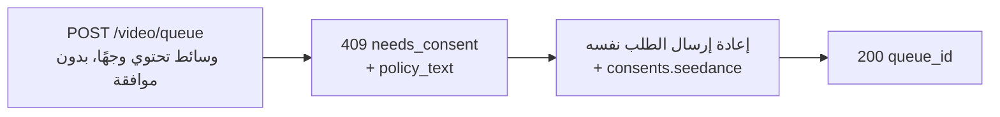

تستطيع نماذج Seedance 2.0 من نوع image-to-video وreference-to-video توليد فيديو من **وجه بشري** تقدّمه. عندما يكتشف Venice API وجهًا في الوسائط المُرسَلة، يتطلب **إقرار موافقة** لمرة واحدة قبل معالجة الوسائط. هذا متطلَّب من المزوّد للمدخلات التي تحتوي على وجوه، ويحمي من استخدام الشبه دون موافقة.

يشرح هذا الدليل بدقة ما ترسله، وما تتلقاه، وكيف تُعالَج الطلبات المتكررة.

## متى تنطبق الموافقة

يُطلب الإقرار فقط عند تحقّق **الشرطين** معًا:

1. يكون النموذج من متغيرات Seedance المؤهّلة للوجوه:
   - `seedance-2-0-image-to-video`, `seedance-2-0-reference-to-video`
   - `seedance-2-0-fast-image-to-video`, `seedance-2-0-fast-reference-to-video`
2. تحتوي الوسائط المُرسَلة فعليًا على وجه بشري قابل للاكتشاف، في أي من هذه الحقول: `image_url` أو `end_image_url` أو `reference_image_urls` أو `reference_video_urls`.

إذا **لم يكن هناك وجه** في أيٍّ من هذه الحقول، يستمر الطلب بشكل طبيعي دون خطوة موافقة. ولا يدخل تحويل النص إلى فيديو هذا التدفّق أبدًا.

<Note>
لا تُلغي الموافقة المحتوى المقيَّد. يُرفض **القاصر المكتشف مع موجّهات ذات إيحاءات جنسية/NSFW**، أو شَبَه **شخصية عامة معروفة**، باعتباره مخالفة لسياسة المحتوى (`422`) و**لا يمكن** جعله مقبولًا عبر إقرار الموافقة.
</Note>

## التدفّق المكوّن من نداءين



### النداء 1 — الإرسال دون موافقة

أرسل طلب التوليد كالعادة — دون حقل موافقة:

```bash
curl -X POST https://api.venice.ai/api/v1/video/queue \
  -H "Authorization: Bearer $VENICE_API_KEY" \
  -H "Content-Type: application/json" \
  -d '{
    "model": "seedance-2-0-reference-to-video",
    "prompt": "Refer to <Subject 1> in <Image 1> to generate a 5-second clip of the same person walking through a sunlit market.",
    "reference_image_urls": ["https://example.com/person.jpg"],
    "duration": "5s",
    "aspect_ratio": "9:16",
    "resolution": "1080p"
  }'
```

إذا تم اكتشاف وجه ولم تكن قد أقررت بعد، ستحصل على **`409`** بدون احتساب رسوم:

```json
{
  "error": {
    "code": "needs_consent",
    "message": "Seedance consent is required for this request."
  },
  "consent_flow": "seedance",
  "face_media_roles": ["reference_image"],
  "consent": {
    "consent_version": "v2.0",
    "policy_text": "The likeness in any media you upload is your own, or you have explicit, legal consent from any depicted individual(s). Note: an image may contain more than one face — your attestation covers all of them.\nYou own or have permission to use all media you uploaded for content generation.\nYou agree to the Venice.ai Terms of Service and Privacy Policy. Violations can lead to account suspension and legal liability.\nNo content is stored by Venice."
  },
  "docs_url": "https://docs.venice.ai/guides/media/seedance-face-consent"
}
```

| الحقل | المعنى |
|---|---|
| `face_media_roles` | أيٌّ من مدخلاتك يحتوي على وجه: `image` أو `end_image` أو `reference_image` أو `reference_video` |
| `consent.policy_text` | نص الإقرار الدقيق الذي يجب الموافقة عليه. اعرضه على المسؤول عن الطلب. |
| `consent.consent_version` | إصدار السياسة الحالي (يحدّده الخادم؛ قد يتغير بمرور الوقت). معلوماتي — لا تُعيده إلى الخادم. |

لا تُحتسب أي أرصدة أو دفعة x402 على استجابة `409`.

### النداء 2 — إعادة الإرسال مع الموافقة

أعِد إرسال **نفس جسم الطلب**، مع إضافة كائن `consents.seedance` يحتوي ثلاث تأكيدات، جميعها `true`:

```bash
curl -X POST https://api.venice.ai/api/v1/video/queue \
  -H "Authorization: Bearer $VENICE_API_KEY" \
  -H "Content-Type: application/json" \
  -d '{
    "model": "seedance-2-0-reference-to-video",
    "prompt": "Refer to <Subject 1> in <Image 1> to generate a 5-second clip of the same person walking through a sunlit market.",
    "reference_image_urls": ["https://example.com/person.jpg"],
    "duration": "5s",
    "aspect_ratio": "9:16",
    "resolution": "1080p",
    "consents": {
      "seedance": {
        "confirmed_terms_and_privacy": true,
        "confirmed_legal_right": true,
        "confirmed_screening_acknowledged": true
      }
    }
  }'
```

عند نجاح الإرسال، تُعاد استجابة الطابور المعتادة:

```json
{ "model": "seedance-2-0-reference-to-video", "queue_id": "..." }
```

ثم استعلم عن `POST /api/v1/video/retrieve` باستخدام `queue_id` كالمعتاد (راجع [توليد الفيديو](/ar/guides/media/video-generation)).

## كائن الموافقة

```json
{
  "confirmed_terms_and_privacy": true,
  "confirmed_legal_right": true,
  "confirmed_screening_acknowledged": true
}
```

| الحقل | تؤكّد بأنّك… |
|---|---|
| `confirmed_terms_and_privacy` | تقبل `policy_text` المُعاد في الـ `409`، بما في ذلك شروط خدمة Venice وسياسة الخصوصية |
| `confirmed_legal_right` | الشبه يخصّك أو لديك موافقة قانونية صريحة من كل شخص يظهر |
| `confirmed_screening_acknowledged` | تُقرّ بأن الوسائط المُرسَلة قد تُفحَص تلقائيًا قبل المعالجة |

<Warning>
يجب أن تكون الحقول الثلاثة قيمتها المنطقية `true`. أي حقل ناقص، أو `false`، أو أي حقل **إضافي** — بما في ذلك `consent_version` — يُرفض بـ `400`. يحدّد الخادم دائمًا إصدار السياسة؛ ولا يُرسل العملاء أو يختارون إصدارًا أبدًا.
</Warning>

## الطلبات المتكررة (إلغاء التكرار)

إذا أرسلت **نفس بايتات الوسائط بالضبط** التي سبق وأقررت بها، يتعرّف الـ API عليها ويستمر **دون** طلب موافقة مرة أخرى — يمكنك حذف `consents.seedance` في الإرسالات المتطابقة لاحقًا. تتم المطابقة عبر بايتات الصورة الدقيقة: إعادة الترميز أو تغيير الحجم أو الاقتصاص يُنتج بايتات مختلفة وسيستلزم موافقة جديدة.

أما المطابقة الجزئية (مدخل سبق إقراره مع مدخل وجه جديد) فلا تزال تتطلب `consents.seedance` جديدًا عند الإرسال الجديد.

## الإلغاء (Revocation)

لإلغاء الموافقة ومسح أصول الوجوه المخزَّنة، سجّل الدخول إلى تطبيق Venice على الويب (**Settings**). الإلغاء غير متاح عبر الـ API العامة. بعد الإلغاء، سيستلزم الطلب التالي الذي يستخدم تلك الوسائط موافقة جديدة.

## الدفع

يتم اتخاذ قرار الموافقة دائمًا **قبل** أي رسم، لكلا طريقتي الدفع:

- **مفتاح API:** يُعاد `409`/`422` قبل خصم الرصيد؛ لا تُحتسب رسوم على طلب مرفوض.
- **x402:** تُحسب رسوم الاستهلاك فقط بعد توليد ناجح، لذا فإن `409`/`422` لا يُسوّي أي شيء. أعِد الإرسال مع موافقة (وتفويض x402 جديد) للمتابعة.

## مرجع الأخطاء

| الحالة | `error` في الجسم | السبب |
|---|---|---|
| `409` | `needs_consent` | تم اكتشاف وجه، ولا يوجد `consents.seedance` صالح، ولا توجد مطابقة دقيقة للوسائط. أعِد الإرسال مع موافقة. |
| `400` | خطأ تحقق | `consents.seedance` مُشوَّه — تأكيد ناقص/قيمته `false` أو حقل إضافي مثل `consent_version`. |
| `422` | `CONTENT_POLICY_VIOLATION` | اكتُشف قاصر مع محتوى موحٍ/NSFW، أو شَبَه شخصية عامة. الموافقة لا تتجاوز هذا. |
| `422` | `IMAGE_ASPECT_RATIO_OUT_OF_BOUNDS` | **صورة فيها وجه مكتشف** خارج نطاق نسبة العرض/الارتفاع المسموح به `(0.4, 2.5)`. يُتحقق منها بشكل متزامن أثناء توفير أصل الوجه (قبل الرسم)؛ ينطبق فقط بعد اكتشاف وجه في تلك الصورة. |

## المراجع

- نقطة نهاية طابور الفيديو: [`POST /api/v1/video/queue`](/ar/api-reference/endpoint/video/queue)
- [دليل Seedance 2.0](/ar/guides/media/seedance-2-0) — المتغيرات وسير العمل وبناء جملة الموجّه والحدود
- [توليد الفيديو](/ar/guides/media/video-generation) — لمحة عن الطابور والاستعلام
