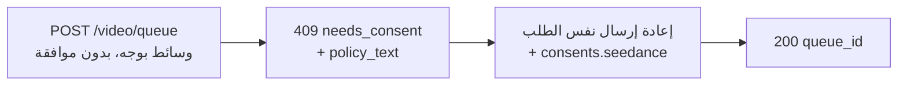

يمكن لنماذج Seedance 2.0 من image-to-video و reference-to-video تحريك فيديو بناءً على **وجه بشري** تقدمه. عندما يكتشف Venice API وجهًا في الوسائط المُرسَلة، فإنه يتطلب **إقرار موافقة** لمرة واحدة قبل معالجة الوسائط. هذا متطلب من المزود للمدخلات التي تحتوي على وجه ويحمي من استخدام الشبه دون موافقة.

يغطي هذا الدليل بالضبط ما ترسله وما تستقبله وكيف يتم التعامل مع الطلبات المتكررة.

## متى تنطبق الموافقة

تُطلب الموافقة فقط عندما يكون **كلا** الشرطين صحيحًا:

1. النموذج هو متغير Seedance مؤهل لمعالجة الوجوه:
   - `seedance-2-0-image-to-video`, `seedance-2-0-reference-to-video`
   - `seedance-2-0-fast-image-to-video`, `seedance-2-0-fast-reference-to-video`
2. الوسائط المُرسَلة تحتوي فعليًا على وجه بشري قابل للاكتشاف، في أي من هذه الحقول: `image_url`، `end_image_url`، `reference_image_urls`، `reference_video_urls`.

إذا لم يكن هناك **أي وجه** في أي من تلك الحقول، يستمر الطلب بشكل طبيعي دون خطوة موافقة. لا يدخل text-to-video أبدًا في هذا التدفق.

<Note>
الموافقة لا تفتح المحتوى المقيد. الكشف عن **قاصر مع مطالبات ذات إيحاءات جنسية/NSFW**، أو شبه **شخصية عامة** يمكن التعرف عليها، يُرفض كانتهاك لسياسة المحتوى (`422`) و**لا يمكن** جعله مقبولًا عبر إقرار الموافقة.
</Note>

## تدفق الاستدعاءين



### الاستدعاء 1 — الإرسال بدون موافقة

أرسل طلب التوليد كالمعتاد — دون حقل موافقة:

```bash
curl -X POST https://api.venice.ai/api/v1/video/queue \
  -H "Authorization: Bearer $VENICE_API_KEY" \
  -H "Content-Type: application/json" \
  -d '{
    "model": "seedance-2-0-reference-to-video",
    "prompt": "Refer to <Subject 1> in <Image 1> to generate a 5-second clip of the same person walking through a sunlit market.",
    "reference_image_urls": ["https://example.com/person.jpg"],
    "duration": "5s",
    "aspect_ratio": "9:16",
    "resolution": "1080p"
  }'
```

إذا تم اكتشاف وجه ولم تكن قد أقررت بعد، تحصل على **`409`** دون احتساب رسوم:

```json
{
  "error": {
    "code": "needs_consent",
    "message": "Seedance consent is required for this request."
  },
  "consent_flow": "seedance",
  "face_media_roles": ["reference_image"],
  "consent": {
    "consent_version": "v2.0",
    "policy_text": "The likeness in any media you upload is your own, or you have explicit, legal consent from any depicted individual(s). Note: an image may contain more than one face — your attestation covers all of them.\nYou own or have permission to use all media you uploaded for content generation.\nYou agree to the Venice.ai Terms of Service and Privacy Policy. Violations can lead to account suspension and legal liability.\nNo content is stored by Venice."
  },
  "docs_url": "https://docs.venice.ai/guides/media/seedance-face-consent"
}
```

| الحقل | المعنى |
|---|---|
| `face_media_roles` | أي من مدخلاتك يحتوي على وجه: `image`, `end_image`, `reference_image`, `reference_video` |
| `consent.policy_text` | نص الإقرار الدقيق الذي يجب أن توافق عليه. قدّمه لمن هو مسؤول عن الطلب. |
| `consent.consent_version` | إصدار السياسة الحالي (يحدده الخادم؛ قد يتغير مع الوقت). للإعلام فقط — لا ترسله مرة أخرى. |

لا يتم احتساب أي اعتمادات أو دفعات x402 على `409`.

### الاستدعاء 2 — إعادة الإرسال مع الموافقة

أعد إرسال **نفس جسم الطلب**، مع إضافة كائن `consents.seedance` بثلاث تأكيدات، جميعها `true`:

```bash
curl -X POST https://api.venice.ai/api/v1/video/queue \
  -H "Authorization: Bearer $VENICE_API_KEY" \
  -H "Content-Type: application/json" \
  -d '{
    "model": "seedance-2-0-reference-to-video",
    "prompt": "Refer to <Subject 1> in <Image 1> to generate a 5-second clip of the same person walking through a sunlit market.",
    "reference_image_urls": ["https://example.com/person.jpg"],
    "duration": "5s",
    "aspect_ratio": "9:16",
    "resolution": "1080p",
    "consents": {
      "seedance": {
        "confirmed_terms_and_privacy": true,
        "confirmed_legal_right": true,
        "confirmed_screening_acknowledged": true
      }
    }
  }'
```

يعيد الإرسال الناجح استجابة قائمة الانتظار العادية:

```json
{ "model": "seedance-2-0-reference-to-video", "queue_id": "..." }
```

ثم استعلم عن `POST /api/v1/video/retrieve` باستخدام `queue_id` كالمعتاد (انظر [توليد الفيديو](/guides/media/video-generation)).

## كائن الموافقة

```json
{
  "confirmed_terms_and_privacy": true,
  "confirmed_legal_right": true,
  "confirmed_screening_acknowledged": true
}
```

| الحقل | تؤكد أن… |
|---|---|
| `confirmed_terms_and_privacy` | أنك تقبل `policy_text` المُعاد في `409`، بما في ذلك شروط خدمة Venice وسياسة الخصوصية |
| `confirmed_legal_right` | أن الشبه هو ملكك أو لديك موافقة قانونية صريحة من كل شخص مصوَّر |
| `confirmed_screening_acknowledged` | أنك تقر بأن الوسائط المُرسلة قد تخضع للفحص التلقائي قبل المعالجة |

<Warning>
يجب أن تكون جميع الحقول الثلاثة قيمة منطقية `true`. أي حقل مفقود أو `false` أو أي حقل **إضافي** — بما في ذلك `consent_version` — يُرفض بـ `400`. إصدار السياسة يحدده الخادم دائمًا؛ لا يرسل العملاء أبدًا إصدارًا ولا يختارونه.
</Warning>

## الطلبات المتكررة (إزالة التكرار)

إذا أرسلت **نفس بايتات الوسائط بالضبط** التي سبق أن أقررت بها، فإن API يتعرف عليها ويتابع **دون** طلب موافقة مرة أخرى — يمكنك حذف `consents.seedance` في عمليات الإرسال المتطابقة اللاحقة. تتم هذه المطابقة عبر بايتات الصورة بالضبط: إعادة الترميز أو تغيير الحجم أو الاقتصاص ينتج بايتات مختلفة وسيطلب الموافقة مجددًا.

المطابقة الجزئية (مُدخل واحد سبق إقراره بالإضافة إلى مُدخل وجه جديد) لا تزال تتطلب `consents.seedance` جديدة في الإرسال الجديد.

## الإلغاء

لإلغاء الموافقة ومسح أصول الوجه المخزنة، سجل الدخول إلى تطبيق Venice على الويب (**Settings**). الإلغاء غير متاح عبر واجهة API العامة. بعد الإلغاء، سيطلب الطلب التالي الذي يستخدم تلك الوسائط الموافقة مرة أخرى.

## الدفع

يتم اتخاذ قرار الموافقة دائمًا **قبل** أي رسوم، لكلتا طريقتي الدفع:

- **مفتاح API:** تُعاد `409`/`422` قبل احتساب الرسوم؛ لا تُحاسَب على طلب محظور.
- **x402:** تُحتسب رسوم الاستهلاك فقط بعد التوليد الناجح، لذا فإن `409`/`422` لا تُسوي شيئًا. أعد الإرسال بالموافقة (وتفويض x402 جديد) للمتابعة.

## مرجع الأخطاء

| الحالة | جسم `error` | السبب |
|---|---|---|
| `409` | `needs_consent` | تم اكتشاف وجه، ولا توجد `consents.seedance` صالحة، ولا توجد مطابقة وسائط دقيقة. أعد الإرسال مع الموافقة. |
| `400` | خطأ في التحقق | `consents.seedance` غير صحيحة — تأكيد مفقود/`false` أو حقل إضافي مثل `consent_version`. |
| `422` | `CONTENT_POLICY_VIOLATION` | تم اكتشاف قاصر مع محتوى إيحائي/NSFW، أو شبه شخصية عامة. الموافقة لا تتجاوز ذلك. |
| `422` | `IMAGE_ASPECT_RATIO_OUT_OF_BOUNDS` | **صورة بها وجه مكتشف** خارج نسبة العرض/الارتفاع المسموح بها `(0.4, 2.5)`. يتم فحصها بشكل متزامن أثناء توفير أصل الوجه (قبل احتساب الرسوم)؛ تنطبق فقط عندما يتم اكتشاف وجه في تلك الصورة. |

## المراجع

- نقطة نهاية قائمة انتظار الفيديو: [`POST /api/v1/video/queue`](/api-reference/endpoint/video/queue)
- [دليل Seedance 2.0](/guides/media/seedance-2-0) — المتغيرات وسير العمل وصياغة المطالبات والحدود
- [توليد الفيديو](/guides/media/video-generation) — نظرة عامة على قائمة الانتظار/الاستعلام
