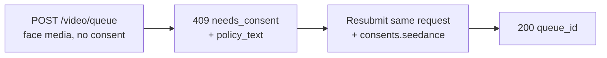

يمكن لنماذج Seedance 2.0 من الصورة والمرجع إلى الفيديو أن تُشغّل فيديو انطلاقًا من **وجه بشري** تُقدّمه. عندما تكتشف Venice API وجهًا في الوسائط التي أرسلتها، فإنها تشترط **تصديق موافقة** لمرة واحدة قبل معالجة الوسائط. هذا مطلب من المزوّد للمدخلات التي تحتوي على وجوه ويحمي من الاستخدام غير المُوافَق عليه للتشابه.

يغطّي هذا الدليل بدقّة ما ترسله وما يُعاد إليك وكيف تُعالَج الطلبات المتكرّرة.

## متى تنطبق الموافقة

لا تُطلَب الموافقة إلا عندما يتحقّق **كلا** الشرطين:

1. أن يكون النموذج متغيرًا من Seedance مؤهّلًا للوجوه:
   - `seedance-2-0-image-to-video` و`seedance-2-0-reference-to-video`
   - `seedance-2-0-fast-image-to-video` و`seedance-2-0-fast-reference-to-video`
2. أن تحتوي الوسائط المُرسَلة فعليًا على وجه بشري قابل للاكتشاف في أيٍّ من هذه الحقول: `image_url` أو `end_image_url` أو `reference_image_urls` أو `reference_video_urls`.

إذا **لم يكن هناك وجه** في أيٍّ من تلك الحقول، فيتقدّم الطلب بشكل طبيعي دون خطوة موافقة. لا يدخل التحويل من النص إلى الفيديو أبدًا في هذا التدفّق.

<Note>
الموافقة لا تفتح المحتوى المقيّد. يُرفض اكتشاف **قاصر مقترنًا بتعليمات ذات إيحاءات جنسية أو NSFW**، أو تشابه **شخصية عامة قابلة للتعرّف عليها**، بوصفه انتهاكًا لسياسة المحتوى (`422`)، ولا **يمكن** جعله مقبولًا بتصديق الموافقة.
</Note>

## تدفّق الاستدعائين


```mermaid
flowchart LR
  A[POST /video/queue<br/>face media, no consent] --> B[409 needs_consent<br/>+ policy_text]
  B --> C[Resubmit same request<br/>+ consents.seedance]
  C --> D[200 queue_id]
```

### الاستدعاء 1 — إرسال بدون موافقة

أرسل طلب التوليد كالمعتاد دون حقل موافقة:

```bash
curl -X POST https://api.venice.ai/api/v1/video/queue \
  -H "Authorization: Bearer $VENICE_API_KEY" \
  -H "Content-Type: application/json" \
  -d '{
    "model": "seedance-2-0-reference-to-video",
    "prompt": "Refer to <Subject 1> in <Image 1> to generate a 5-second clip of the same person walking through a sunlit market.",
    "reference_image_urls": ["https://example.com/person.jpg"],
    "duration": "5s",
    "aspect_ratio": "9:16",
    "resolution": "1080p"
  }'
```

إذا اكتُشِف وجه ولم تُصدّق بعد، فستحصل على **`409`** غير مُحاسَب عليه:

```json
{
  "error": {
    "code": "needs_consent",
    "message": "Seedance consent is required for this request."
  },
  "consent_flow": "seedance",
  "face_media_roles": ["reference_image"],
  "consent": {
    "consent_version": "v2.0",
    "policy_text": "The likeness in any media you upload is your own, or you have explicit, legal consent from any depicted individual(s). Note: an image may contain more than one face — your attestation covers all of them.\nYou own or have permission to use all media you uploaded for content generation.\nYou agree to the Venice.ai Terms of Service and Privacy Policy. Violations can lead to account suspension and legal liability.\nNo content is stored by Venice."
  },
  "docs_url": "https://docs.venice.ai/guides/media/seedance-face-consent"
}
```

| الحقل | المعنى |
|---|---|
| `face_media_roles` | أيٌّ من مدخلاتك يحتوي على وجه: `image` أو `end_image` أو `reference_image` أو `reference_video` |
| `consent.policy_text` | نص التصديق الحرفي الذي يجب أن توافق عليه. اعرضه على المسؤول عن الطلب. |
| `consent.consent_version` | إصدار السياسة الحالي (يضبطه الخادم؛ قد يتغيّر بمرور الوقت). للعلم فقط، أنت **لا** تُعيد إرساله. |

لا تُحصَّل أي رصيدات ولا مدفوعات x402 عند الرد `409`.

### الاستدعاء 2 — إعادة الإرسال مع الموافقة

أعد إرسال **نفس جسم الطلب** مع إضافة كائن `consents.seedance` يتضمّن ثلاثة تأكيدات، كلها `true`:

```bash
curl -X POST https://api.venice.ai/api/v1/video/queue \
  -H "Authorization: Bearer $VENICE_API_KEY" \
  -H "Content-Type: application/json" \
  -d '{
    "model": "seedance-2-0-reference-to-video",
    "prompt": "Refer to <Subject 1> in <Image 1> to generate a 5-second clip of the same person walking through a sunlit market.",
    "reference_image_urls": ["https://example.com/person.jpg"],
    "duration": "5s",
    "aspect_ratio": "9:16",
    "resolution": "1080p",
    "consents": {
      "seedance": {
        "confirmed_terms_and_privacy": true,
        "confirmed_legal_right": true,
        "confirmed_screening_acknowledged": true
      }
    }
  }'
```

يُعيد الإرسال الناجح استجابة الطابور المعتادة:

```json
{ "model": "seedance-2-0-reference-to-video", "queue_id": "..." }
```

ثم استعلم عبر `POST /api/v1/video/retrieve` باستخدام `queue_id` كالمعتاد (راجع [توليد الفيديو](/guides/media/video-generation)).

## كائن الموافقة

```json
{
  "confirmed_terms_and_privacy": true,
  "confirmed_legal_right": true,
  "confirmed_screening_acknowledged": true
}
```

| الحقل | تؤكّد أنّ… |
|---|---|
| `confirmed_terms_and_privacy` | أنك تقبل نص `policy_text` المُعاد في الرد `409`، بما في ذلك شروط خدمة Venice وسياسة الخصوصية |
| `confirmed_legal_right` | أنّ التشابه هو تشابهك أنت، أو أن لديك موافقة صريحة وقانونية من كل فرد يظهر في الوسائط |
| `confirmed_screening_acknowledged` | أنك تُقرّ بأنّ الوسائط المُرسَلة قد تُفحَص تلقائيًا قبل المعالجة |

<Warning>
يجب أن تكون الحقول الثلاثة جميعها بقيمة `true` المنطقية. أي حقل ناقص، أو قيمة `false`، أو أي حقل **إضافي**، بما في ذلك `consent_version`، يُرفض بردّ `400`. يضبط الخادم دائمًا إصدار السياسة، والعملاء لا يُرسلون إصدارًا ولا يختارونه إطلاقًا.
</Warning>

## الطلبات المتكرّرة (إزالة التكرار)

إذا أرسلت **نفس بايتات الوسائط بالضبط** التي سبق أن صدّقت عليها، تتعرّف عليها الواجهة وتتقدّم **دون** طلب الموافقة مرّة أخرى، ويمكنك حذف `consents.seedance` من عمليات الإرسال المتطابقة اللاحقة. تتم هذه المطابقة عبر بايتات الصورة الدقيقة: إعادة الترميز أو تغيير الحجم أو الاقتصاص تُنتج بايتات مختلفة وستؤدّي إلى طلب الموافقة مجددًا.

المطابقة الجزئية (مدخل واحد سبق التصديق عليه مع مدخل وجه جديد) لا تزال تتطلّب `consents.seedance` جديدًا عند الإرسال الجديد.

## الإلغاء

لإلغاء الموافقة ومحو أصول الوجه المخزّنة، سجّل الدخول إلى تطبيق Venice على الويب (**Settings**). الإلغاء غير متاح عبر واجهة برمجة التطبيقات العامة. بعد الإلغاء، سيطلب الطلب التالي الذي يستخدم تلك الوسائط الموافقة من جديد.

## الدفع

يقع قرار الموافقة دائمًا **قبل** أي محاسبة، لكلتا طريقتَي الدفع:

- **مفتاح API:** يعود ردّ `409`/`422` قبل محاسبة الرصيد؛ فلا تُحصَّل أي مبالغ على طلب محجوب.
- **x402:** لا تُنفَّذ محاسبة الاستهلاك إلا بعد توليد ناجح، لذا فإن ردّ `409`/`422` لا يُسوّي شيئًا. أعد الإرسال مع الموافقة (وتفويض x402 جديد) للمتابعة.

## مرجع الأخطاء

| الحالة | `error` في الجسم | السبب |
|---|---|---|
| `409` | `needs_consent` | تم اكتشاف وجه، ولا يوجد `consents.seedance` صالح، ولا مطابقة دقيقة للوسائط. أعد الإرسال مع الموافقة. |
| `400` | خطأ تحقّق | `consents.seedance` مشوّه، بسبب تأكيد ناقص/`false` أو حقل إضافي مثل `consent_version`. |
| `422` | `CONTENT_POLICY_VIOLATION` | اكتشاف قاصر مع محتوى إيحائي/NSFW، أو تشابه لشخصية عامة. الموافقة لا تتجاوز هذا. |
| `422` | `IMAGE_ASPECT_RATIO_OUT_OF_BOUNDS` | **صورة اكتُشِف فيها وجه** خارج نسبة العرض/الارتفاع المسموح بها `(0.4, 2.5)`. يُفحَص هذا بشكل متزامن أثناء توفير أصول الوجه (قبل المحاسبة)؛ وينطبق فقط عند اكتشاف وجه في تلك الصورة. |

## المراجع

- نقطة نهاية طابور الفيديو: [`POST /api/v1/video/queue`](/api-reference/endpoint/video/queue)
- [دليل Seedance 2.0](/guides/media/seedance-2-0) — المتغيرات وسير العمل وبناء التعليمة والحدود
- [توليد الفيديو](/guides/media/video-generation) — نظرة عامة على الطابور / الاستعلام
