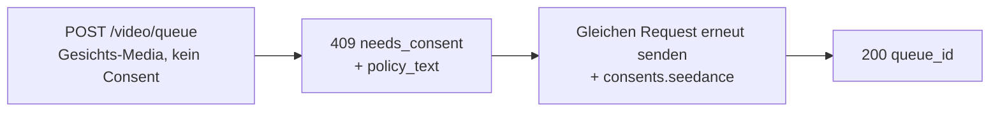

Seedance-2.0-Image- und -Reference-to-Video-Modelle können ein Video aus einem **menschlichen Gesicht** treiben, das du bereitstellst. Wenn die Venice-API in deinen Medien ein Gesicht erkennt, verlangt sie vor der Verarbeitung eine einmalige **Consent-Attestation**. Das ist eine Provider-Anforderung für gesichtsbehaftete Inputs und schützt vor nicht einvernehmlicher Nutzung einer Person.

Dieser Guide zeigt genau, was du sendest, was du zurückbekommst und wie wiederkehrende Anfragen behandelt werden.

## Wann Consent gilt

Consent wird nur angefordert, wenn **beides** zutrifft:

1. Das Modell ist eine gesichts-eligible Seedance-Variante:
   - `seedance-2-0-image-to-video`, `seedance-2-0-reference-to-video`
   - `seedance-2-0-fast-image-to-video`, `seedance-2-0-fast-reference-to-video`
2. Die übermittelten Medien enthalten tatsächlich ein erkennbares menschliches Gesicht in einem der Felder: `image_url`, `end_image_url`, `reference_image_urls`, `reference_video_urls`.

Wenn in keinem dieser Felder ein Gesicht vorhanden ist, läuft der Request normal ohne Consent-Schritt. Text-to-Video durchläuft diesen Flow nie.

<Note>
Consent schaltet keine eingeschränkten Inhalte frei. Eine erkannte **minderjährige Person zusammen mit sexuell suggestiven Prompts/NSFW** oder eine wiedererkennbare **Public-Figure-Ähnlichkeit** wird als Content-Policy-Verstoß (`422`) abgelehnt und kann **nicht** durch Attestation akzeptabel gemacht werden.
</Note>

## Der Zwei-Call-Flow



### Call 1 — ohne Consent senden

Sende deinen Generierungs-Request wie üblich – ohne Consent-Feld:

```bash
curl -X POST https://api.venice.ai/api/v1/video/queue \
  -H "Authorization: Bearer $VENICE_API_KEY" \
  -H "Content-Type: application/json" \
  -d '{
    "model": "seedance-2-0-reference-to-video",
    "prompt": "Refer to <Subject 1> in <Image 1> to generate a 5-second clip of the same person walking through a sunlit market.",
    "reference_image_urls": ["https://example.com/person.jpg"],
    "duration": "5s",
    "aspect_ratio": "9:16",
    "resolution": "1080p"
  }'
```

Wird ein Gesicht erkannt und hast du noch nicht attestiert, bekommst du ein kostenloses **`409`**:

```json
{
  "error": {
    "code": "needs_consent",
    "message": "Seedance consent is required for this request."
  },
  "consent_flow": "seedance",
  "face_media_roles": ["reference_image"],
  "consent": {
    "consent_version": "v2.0",
    "policy_text": "The likeness in any media you upload is your own, or you have explicit, legal consent from any depicted individual(s). Note: an image may contain more than one face — your attestation covers all of them.\nYou own or have permission to use all media you uploaded for content generation.\nYou agree to the Venice.ai Terms of Service and Privacy Policy. Violations can lead to account suspension and legal liability.\nNo content is stored by Venice."
  },
  "docs_url": "https://docs.venice.ai/guides/media/seedance-face-consent"
}
```

| Feld | Bedeutung |
|---|---|
| `face_media_roles` | Welche deiner Inputs ein Gesicht enthalten: `image`, `end_image`, `reference_image`, `reference_video` |
| `consent.policy_text` | Der exakte Attestations-Text, dem du zustimmen musst. Lege ihn der für den Request verantwortlichen Person vor. |
| `consent.consent_version` | Die aktuelle Policy-Version (vom Server gesetzt; kann sich ändern). Informationell – du sendest sie **nicht** zurück. |

Bei einem `409` werden weder Credits noch x402-Zahlung berechnet.

### Call 2 — mit Consent erneut senden

Sende denselben **Request-Body** erneut, ergänzt um ein `consents.seedance`-Objekt mit drei Bestätigungen, alle `true`:

```bash
curl -X POST https://api.venice.ai/api/v1/video/queue \
  -H "Authorization: Bearer $VENICE_API_KEY" \
  -H "Content-Type: application/json" \
  -d '{
    "model": "seedance-2-0-reference-to-video",
    "prompt": "Refer to <Subject 1> in <Image 1> to generate a 5-second clip of the same person walking through a sunlit market.",
    "reference_image_urls": ["https://example.com/person.jpg"],
    "duration": "5s",
    "aspect_ratio": "9:16",
    "resolution": "1080p",
    "consents": {
      "seedance": {
        "confirmed_terms_and_privacy": true,
        "confirmed_legal_right": true,
        "confirmed_screening_acknowledged": true
      }
    }
  }'
```

Ein erfolgreicher Submit liefert die normale Queue-Antwort:

```json
{ "model": "seedance-2-0-reference-to-video", "queue_id": "..." }
```

Anschließend `POST /api/v1/video/retrieve` mit der `queue_id` wie gewohnt pollen (siehe [Videogenerierung](/guides/media/video-generation)).

## Das Consent-Objekt

```json
{
  "confirmed_terms_and_privacy": true,
  "confirmed_legal_right": true,
  "confirmed_screening_acknowledged": true
}
```

| Feld | Du bestätigst, dass… |
|---|---|
| `confirmed_terms_and_privacy` | du den im `409` zurückgegebenen `policy_text` akzeptierst, inklusive der Venice Terms of Service und Privacy Policy |
| `confirmed_legal_right` | die Person bzw. das Abbild dir gehört oder du von jeder dargestellten Person ausdrückliche, rechtmäßige Zustimmung hast |
| `confirmed_screening_acknowledged` | du anerkennst, dass eingereichte Medien vor der Verarbeitung automatisch gescreent werden können |

<Warning>
Alle drei Felder müssen den Boolean `true` enthalten. Ein fehlendes Feld, ein `false` oder ein **zusätzliches** Feld – einschließlich `consent_version` – wird mit `400` abgelehnt. Die Policy-Version wird immer vom Server gesetzt; Clients senden oder wählen nie eine Version.
</Warning>

## Wiederkehrende Anfragen (Dedupe)

Wenn du **exakt dieselben Medien-Bytes** sendest, denen du bereits zugestimmt hast, erkennt die API das und fährt **ohne** erneute Consent-Anforderung fort – du kannst `consents.seedance` bei nachfolgenden identischen Submits weglassen. Der Abgleich erfolgt anhand exakter Bild-Bytes: Re-Encoding, Resizen oder Croppen erzeugt andere Bytes und löst erneut die Consent-Abfrage aus.

Ein Teil-Match (ein zuvor attestierter Input plus ein neuer Gesichts-Input) erfordert weiterhin ein neues `consents.seedance` für den neuen Submit.

## Widerruf

Um Consent zu widerrufen und gespeicherte Gesichts-Assets zu löschen, melde dich in der Venice-Web-App an (**Settings**). Widerruf ist nicht über die öffentliche API verfügbar. Nach dem Widerruf löst der nächste Request mit diesem Material erneut die Consent-Abfrage aus.

## Zahlung

Die Consent-Entscheidung erfolgt immer **vor** jeder Abbuchung, für beide Zahlungsmethoden:

- **API-Schlüssel:** Ein `409`/`422` wird vor der Credit-Belastung zurückgegeben; bei einem blockierten Request wird nichts abgerechnet.
- **x402:** Die Verbrauchsabbuchung erfolgt erst nach erfolgreicher Generierung, ein `409`/`422` rechnet also nichts ab. Erneut mit Consent (und einer neuen x402-Autorisierung) senden, um fortzufahren.

## Fehler-Referenz

| Status | Body `error` | Ursache |
|---|---|---|
| `409` | `needs_consent` | Gesicht erkannt, kein gültiges `consents.seedance`, kein exakter Media-Match. Mit Consent erneut senden. |
| `400` | Validierungsfehler | Fehlerhaftes `consents.seedance` – fehlende/`false`-Bestätigung oder ein zusätzliches Feld wie `consent_version`. |
| `422` | `CONTENT_POLICY_VIOLATION` | Erkannte minderjährige Person mit suggestivem/NSFW-Content oder Public-Figure-Ähnlichkeit. Consent setzt das nicht außer Kraft. |
| `422` | `IMAGE_ASPECT_RATIO_OUT_OF_BOUNDS` | Ein **Bild mit erkanntem Gesicht** liegt außerhalb des erlaubten Breiten-/Höhen-Verhältnisses `(0.4, 2.5)`. Wird synchron beim Face-Asset-Provisioning (vor der Abbuchung) geprüft; gilt nur, sobald in diesem Bild ein Gesicht erkannt wurde. |

## Referenzen

- Video-Queue-Endpoint: [`POST /api/v1/video/queue`](/api-reference/endpoint/video/queue)
- [Seedance-2.0-Guide](/guides/media/seedance-2-0) — Varianten, Workflows, Prompt-Syntax, Limits
- [Videogenerierung](/guides/media/video-generation) — Queue-/Polling-Übersicht
