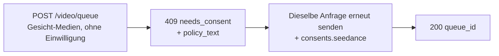

Die Seedance-2.0-Modelle image- und reference-to-video können ein Video aus einem **menschlichen Gesicht** ableiten, das Sie bereitstellen. Erkennt die Venice-API ein Gesicht in den eingereichten Medien, verlangt sie eine einmalige **Einwilligungserklärung**, bevor die Medien verarbeitet werden. Dies ist eine Vorgabe des Anbieters für gesichtshaltige Eingaben und schützt vor nicht einwilligungsbasierter Verwendung von Abbildern.

Dieser Leitfaden beschreibt genau, was Sie senden, was Sie zurückbekommen und wie wiederkehrende Anfragen behandelt werden.

## Wann eine Einwilligung erforderlich ist

Eine Einwilligung wird nur verlangt, wenn **beide** Bedingungen zutreffen:

1. Das Modell ist eine gesichtsfähige Seedance-Variante:
   - `seedance-2-0-image-to-video`, `seedance-2-0-reference-to-video`
   - `seedance-2-0-fast-image-to-video`, `seedance-2-0-fast-reference-to-video`
2. Die eingereichten Medien enthalten tatsächlich ein erkennbares menschliches Gesicht — in einem dieser Felder: `image_url`, `end_image_url`, `reference_image_urls`, `reference_video_urls`.

Ist in keinem dieser Felder ein Gesicht vorhanden, läuft die Anfrage normal weiter, ohne einen Einwilligungsschritt. Text-to-Video durchläuft diesen Flow nie.

<Note>
Eine Einwilligung schaltet keine eingeschränkten Inhalte frei. Eine erkannte **minderjährige Person in Kombination mit sexuell-suggestiven Prompts/NSFW** oder ein erkennbares **Abbild einer öffentlichen Person** wird als Verletzung der Inhaltsrichtlinien zurückgewiesen (`422`) und **kann nicht** durch eine Einwilligung zulässig gemacht werden.
</Note>

## Der Zwei-Call-Flow



### Aufruf 1 — Senden ohne Einwilligung

Senden Sie Ihre Generierungsanfrage wie gewohnt — ohne Einwilligungsfeld:

```bash
curl -X POST https://api.venice.ai/api/v1/video/queue \
  -H "Authorization: Bearer $VENICE_API_KEY" \
  -H "Content-Type: application/json" \
  -d '{
    "model": "seedance-2-0-reference-to-video",
    "prompt": "Refer to <Subject 1> in <Image 1> to generate a 5-second clip of the same person walking through a sunlit market.",
    "reference_image_urls": ["https://example.com/person.jpg"],
    "duration": "5s",
    "aspect_ratio": "9:16",
    "resolution": "1080p"
  }'
```

Wird ein Gesicht erkannt und Sie haben noch nicht zugestimmt, erhalten Sie ein nicht-belastendes **`409`**:

```json
{
  "error": {
    "code": "needs_consent",
    "message": "Seedance consent is required for this request."
  },
  "consent_flow": "seedance",
  "face_media_roles": ["reference_image"],
  "consent": {
    "consent_version": "v2.0",
    "policy_text": "The likeness in any media you upload is your own, or you have explicit, legal consent from any depicted individual(s). Note: an image may contain more than one face — your attestation covers all of them.\nYou own or have permission to use all media you uploaded for content generation.\nYou agree to the Venice.ai Terms of Service and Privacy Policy. Violations can lead to account suspension and legal liability.\nNo content is stored by Venice."
  },
  "docs_url": "https://docs.venice.ai/guides/media/seedance-face-consent"
}
```

| Feld | Bedeutung |
|---|---|
| `face_media_roles` | Welche Ihrer Inputs ein Gesicht enthalten: `image`, `end_image`, `reference_image`, `reference_video` |
| `consent.policy_text` | Der exakte Attestierungstext, dem zugestimmt werden muss. Legen Sie ihn der für die Anfrage verantwortlichen Person vor. |
| `consent.consent_version` | Die aktuelle Richtlinienversion (vom Server gesetzt; kann sich ändern). Informativ — Sie senden sie **nicht** zurück. |

Bei einem `409` werden weder Guthaben noch x402-Zahlungen belastet.

### Aufruf 2 — Erneutes Senden mit Einwilligung

Senden Sie **denselben Request-Body** erneut und ergänzen Sie ein `consents.seedance`-Objekt mit drei Bestätigungen, alle `true`:

```bash
curl -X POST https://api.venice.ai/api/v1/video/queue \
  -H "Authorization: Bearer $VENICE_API_KEY" \
  -H "Content-Type: application/json" \
  -d '{
    "model": "seedance-2-0-reference-to-video",
    "prompt": "Refer to <Subject 1> in <Image 1> to generate a 5-second clip of the same person walking through a sunlit market.",
    "reference_image_urls": ["https://example.com/person.jpg"],
    "duration": "5s",
    "aspect_ratio": "9:16",
    "resolution": "1080p",
    "consents": {
      "seedance": {
        "confirmed_terms_and_privacy": true,
        "confirmed_legal_right": true,
        "confirmed_screening_acknowledged": true
      }
    }
  }'
```

Eine erfolgreiche Einreichung liefert die normale Queue-Antwort zurück:

```json
{ "model": "seedance-2-0-reference-to-video", "queue_id": "..." }
```

Pollen Sie anschließend wie gewohnt `POST /api/v1/video/retrieve` mit der `queue_id` (siehe [Videogenerierung](/de/guides/media/video-generation)).

## Das Einwilligungs-Objekt

```json
{
  "confirmed_terms_and_privacy": true,
  "confirmed_legal_right": true,
  "confirmed_screening_acknowledged": true
}
```

| Feld | Sie bestätigen, dass … |
|---|---|
| `confirmed_terms_and_privacy` | Sie den im `409` zurückgegebenen `policy_text` einschließlich der Venice-Nutzungsbedingungen und Datenschutzerklärung akzeptieren |
| `confirmed_legal_right` | das Abbild Ihr eigenes ist oder Sie die ausdrückliche, rechtswirksame Einwilligung jeder dargestellten Person haben |
| `confirmed_screening_acknowledged` | Sie zur Kenntnis nehmen, dass eingereichte Medien vor der Verarbeitung automatisch geprüft werden können |

<Warning>
Alle drei Felder müssen den booleschen Wert `true` haben. Ein fehlendes Feld, ein `false` oder ein **zusätzliches** Feld — einschließlich eines `consent_version` — wird mit `400` abgelehnt. Die Richtlinienversion wird stets vom Server gesetzt; Clients senden oder wählen niemals eine Version.
</Warning>

## Wiederkehrende Anfragen (Dedupe)

Wenn Sie **exakt dieselben Medienbytes** einreichen, denen Sie bereits zugestimmt haben, erkennt die API dies und fährt **ohne** erneute Einwilligungsabfrage fort — Sie können `consents.seedance` bei identischen Folgeeinreichungen weglassen. Dieser Abgleich erfolgt über exakte Bildbytes: Erneutes Kodieren, Skalieren oder Zuschneiden erzeugt andere Bytes und löst die Einwilligungsabfrage erneut aus.

Ein partieller Treffer (ein zuvor zugestimmter Input plus ein neuer Gesichts-Input) erfordert weiterhin ein frisches `consents.seedance` bei der neuen Einreichung.

## Widerruf

Um die Einwilligung zu widerrufen und gespeicherte Gesichts-Assets zu löschen, melden Sie sich in der Venice-Web-App an (**Settings**). Der Widerruf ist nicht über die öffentliche API verfügbar. Nach dem Widerruf wird die nächste Anfrage mit diesem Material erneut zur Einwilligung auffordern.

## Zahlung

Die Einwilligungsentscheidung findet **immer vor** jeder Belastung statt — für beide Zahlungsmethoden:

- **API-Schlüssel:** Ein `409`/`422` wird vor der Guthabenbelastung zurückgegeben; für eine blockierte Anfrage wird nichts berechnet.
- **x402:** Die Verbrauchsbelastung läuft erst nach erfolgreicher Generierung, ein `409`/`422` rechnet daher nichts ab. Senden Sie erneut mit Einwilligung (und einer frischen x402-Autorisierung), um fortzufahren.

## Fehlerreferenz

| Status | Body `error` | Ursache |
|---|---|---|
| `409` | `needs_consent` | Gesicht erkannt, kein gültiges `consents.seedance`, kein exakter Medien-Treffer. Erneut mit Einwilligung senden. |
| `400` | Validierungsfehler | Fehlerhaftes `consents.seedance` — fehlende/`false`-Bestätigung oder ein zusätzliches Feld wie `consent_version`. |
| `422` | `CONTENT_POLICY_VIOLATION` | Erkannte minderjährige Person mit suggestivem/NSFW-Inhalt oder Abbild einer öffentlichen Person. Eine Einwilligung überschreibt dies nicht. |
| `422` | `IMAGE_ASPECT_RATIO_OUT_OF_BOUNDS` | Ein **Bild mit erkanntem Gesicht** liegt außerhalb des erlaubten Seitenverhältnisses `(0.4, 2.5)`. Wird synchron beim Anlegen des Face-Assets geprüft (vor der Belastung); gilt nur, wenn in diesem Bild ein Gesicht erkannt wurde. |

## Referenzen

- Video-Queue-Endpoint: [`POST /api/v1/video/queue`](/de/api-reference/endpoint/video/queue)
- [Seedance-2.0-Leitfaden](/de/guides/media/seedance-2-0) — Varianten, Workflows, Prompt-Syntax, Limits
- [Videogenerierung](/de/guides/media/video-generation) — Queue-/Polling-Übersicht
