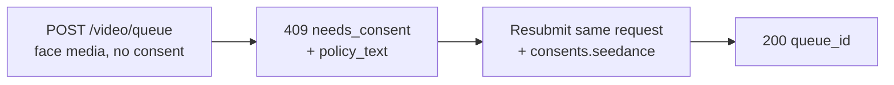

Die Image-to-Video- und Reference-to-Video-Modelle von Seedance 2.0 können ein Video aus einem von Ihnen bereitgestellten **menschlichen Gesicht** erzeugen. Wenn die Venice API in Ihren übermittelten Medien ein Gesicht erkennt, verlangt sie eine einmalige **Consent-Attestierung**, bevor die Medien verarbeitet werden. Dies ist eine Anforderung des Anbieters für Eingaben mit Gesichtern und schützt vor nicht einvernehmlicher Nutzung von Likenesses.

Dieser Leitfaden beschreibt genau, was Sie senden, was Sie zurückerhalten und wie wiederkehrende Anfragen behandelt werden.

## Wann eine Einwilligung erforderlich ist

Eine Einwilligung wird nur angefordert, wenn **beides** zutrifft:

1. Das Modell ist eine face-fähige Seedance-Variante:
   - `seedance-2-0-image-to-video`, `seedance-2-0-reference-to-video`
   - `seedance-2-0-fast-image-to-video`, `seedance-2-0-fast-reference-to-video`
2. Die übermittelten Medien enthalten tatsächlich ein erkennbares menschliches Gesicht, in einem der folgenden Felder: `image_url`, `end_image_url`, `reference_image_urls`, `reference_video_urls`.

Wenn in keinem dieser Felder **ein Gesicht** vorhanden ist, wird die Anfrage normal ohne Consent-Schritt verarbeitet. Text-to-Video durchläuft diesen Ablauf nie.

<Note>
Die Einwilligung gibt keine eingeschränkten Inhalte frei. Ein erkannter **Minderjähriger in Kombination mit sexuell suggestiven Prompts/NSFW** oder eine wiedererkennbare **Likeness einer Person des öffentlichen Lebens** wird als Verstoß gegen die Content-Policy (`422`) abgelehnt und **kann** nicht durch eine Einwilligungsbestätigung zulässig gemacht werden.
</Note>

## Der zweistufige Ablauf


```mermaid
flowchart LR
  A[POST /video/queue<br/>face media, no consent] --> B[409 needs_consent<br/>+ policy_text]
  B --> C[Resubmit same request<br/>+ consents.seedance]
  C --> D[200 queue_id]
```

### Aufruf 1: Übermittlung ohne Einwilligung

Übermitteln Sie Ihre Generierungsanfrage wie gewohnt, ohne Consent-Feld:

```bash
curl -X POST https://api.venice.ai/api/v1/video/queue \
  -H "Authorization: Bearer $VENICE_API_KEY" \
  -H "Content-Type: application/json" \
  -d '{
    "model": "seedance-2-0-reference-to-video",
    "prompt": "Refer to <Subject 1> in <Image 1> to generate a 5-second clip of the same person walking through a sunlit market.",
    "reference_image_urls": ["https://example.com/person.jpg"],
    "duration": "5s",
    "aspect_ratio": "9:16",
    "resolution": "1080p"
  }'
```

Wenn ein Gesicht erkannt wird und Sie noch nicht attestiert haben, erhalten Sie einen nicht abrechnenden **`409`**:

```json
{
  "error": {
    "code": "needs_consent",
    "message": "Seedance consent is required for this request."
  },
  "consent_flow": "seedance",
  "face_media_roles": ["reference_image"],
  "consent": {
    "consent_version": "v2.0",
    "policy_text": "The likeness in any media you upload is your own, or you have explicit, legal consent from any depicted individual(s). Note: an image may contain more than one face — your attestation covers all of them.\nYou own or have permission to use all media you uploaded for content generation.\nYou agree to the Venice.ai Terms of Service and Privacy Policy. Violations can lead to account suspension and legal liability.\nNo content is stored by Venice."
  },
  "docs_url": "https://docs.venice.ai/guides/media/seedance-face-consent"
}
```

| Feld | Bedeutung |
|---|---|
| `face_media_roles` | Welche Ihrer Eingaben ein Gesicht enthalten: `image`, `end_image`, `reference_image`, `reference_video` |
| `consent.policy_text` | Der exakte Attestierungstext, dem Sie zustimmen müssen. Legen Sie ihn derjenigen Person vor, die für die Anfrage verantwortlich ist. |
| `consent.consent_version` | Die aktuelle Richtlinienversion (serverseitig gesetzt; kann sich im Laufe der Zeit ändern). Rein informativ. Sie senden sie **nicht** zurück. |

Bei einem `409` werden keine Credits und keine x402-Zahlung berechnet.

### Aufruf 2: Erneute Übermittlung mit Einwilligung

Senden Sie **denselben Anfrage-Body** erneut und fügen Sie ein `consents.seedance`-Objekt mit drei Bestätigungen hinzu, alle auf `true`:

```bash
curl -X POST https://api.venice.ai/api/v1/video/queue \
  -H "Authorization: Bearer $VENICE_API_KEY" \
  -H "Content-Type: application/json" \
  -d '{
    "model": "seedance-2-0-reference-to-video",
    "prompt": "Refer to <Subject 1> in <Image 1> to generate a 5-second clip of the same person walking through a sunlit market.",
    "reference_image_urls": ["https://example.com/person.jpg"],
    "duration": "5s",
    "aspect_ratio": "9:16",
    "resolution": "1080p",
    "consents": {
      "seedance": {
        "confirmed_terms_and_privacy": true,
        "confirmed_legal_right": true,
        "confirmed_screening_acknowledged": true
      }
    }
  }'
```

Eine erfolgreiche Übermittlung liefert die normale Queue-Antwort zurück:

```json
{ "model": "seedance-2-0-reference-to-video", "queue_id": "..." }
```

Danach pollen Sie `POST /api/v1/video/retrieve` mit der `queue_id` wie gewohnt (siehe [Video Generation](/guides/media/video-generation)).

## Das Consent-Objekt

```json
{
  "confirmed_terms_and_privacy": true,
  "confirmed_legal_right": true,
  "confirmed_screening_acknowledged": true
}
```

| Feld | Sie bestätigen, dass … |
|---|---|
| `confirmed_terms_and_privacy` | Sie den im `409` zurückgegebenen `policy_text` akzeptieren, einschließlich der Venice Terms of Service und Privacy Policy |
| `confirmed_legal_right` | die Likeness Ihre eigene ist oder Sie über die ausdrückliche, rechtlich gültige Einwilligung jeder abgebildeten Person verfügen |
| `confirmed_screening_acknowledged` | Sie zur Kenntnis nehmen, dass übermittelte Medien vor der Verarbeitung automatisch geprüft werden können |

<Warning>
Alle drei Felder müssen den booleschen Wert `true` haben. Ein fehlendes Feld, ein `false` oder ein **zusätzliches** Feld (einschließlich `consent_version`) führt zur Ablehnung mit einem `400`. Die Richtlinienversion wird immer vom Server gesetzt; Clients senden oder wählen niemals eine Version.
</Warning>

## Wiederkehrende Anfragen (Dedupe)

Wenn Sie **exakt dieselben Medienbytes** übermitteln, die Sie bereits attestiert haben, erkennt die API dies und fährt fort, **ohne** erneut nach einer Einwilligung zu fragen. Sie können `consents.seedance` bei nachfolgenden identischen Übermittlungen weglassen. Dieser Abgleich erfolgt anhand exakter Bildbytes: Erneutes Kodieren, Ändern der Größe oder Zuschneiden erzeugt andere Bytes und löst erneut die Consent-Abfrage aus.

Eine Teilübereinstimmung (eine bereits attestierte Eingabe plus eine neue Gesichtseingabe) erfordert bei der neuen Übermittlung weiterhin ein frisches `consents.seedance`.

## Widerruf

Um die Einwilligung zu widerrufen und gespeicherte Face-Assets zu löschen, melden Sie sich in der Venice-Web-App an (**Einstellungen**). Der Widerruf ist über die öffentliche API nicht verfügbar. Nach einem Widerruf löst die nächste Anfrage mit diesen Medien erneut die Consent-Abfrage aus.

## Bezahlung

Die Consent-Entscheidung fällt für beide Zahlungsmethoden immer **vor** einer Abrechnung:

- **API-Key:** ein `409`/`422` wird vor der Credit-Belastung zurückgegeben; für eine blockierte Anfrage wird nichts berechnet.
- **x402:** die Verbrauchsabrechnung erfolgt erst nach einer erfolgreichen Generierung, sodass ein `409`/`422` nichts abrechnet. Übermitteln Sie mit Einwilligung (und einer frischen x402-Autorisierung) erneut, um fortzufahren.

## Fehlerreferenz

| Status | Body `error` | Ursache |
|---|---|---|
| `409` | `needs_consent` | Gesicht erkannt, kein gültiges `consents.seedance`, keine exakte Medienübereinstimmung. Mit Einwilligung erneut übermitteln. |
| `400` | Validierungsfehler | Fehlerhaftes `consents.seedance`: eine fehlende/`false`-Bestätigung oder ein zusätzliches Feld wie `consent_version`. |
| `422` | `CONTENT_POLICY_VIOLATION` | Erkannter Minderjähriger mit suggestiven/NSFW-Inhalten oder Likeness einer Person des öffentlichen Lebens. Die Einwilligung setzt dies nicht außer Kraft. |
| `422` | `IMAGE_ASPECT_RATIO_OUT_OF_BOUNDS` | Ein **Bild mit erkanntem Gesicht** liegt außerhalb des zulässigen Breiten-/Höhenverhältnisses `(0.4, 2.5)`. Wird während der Face-Asset-Bereitstellung synchron geprüft (vor Abrechnung); gilt nur, sobald in diesem Bild ein Gesicht erkannt wurde. |

## Referenzen

- Video-Queue-Endpunkt: [`POST /api/v1/video/queue`](/api-reference/endpoint/video/queue)
- [Seedance 2.0 Guide](/guides/media/seedance-2-0) — Varianten, Workflows, Prompt-Syntax, Limits
- [Video Generation](/guides/media/video-generation) — Überblick Queue / Polling
