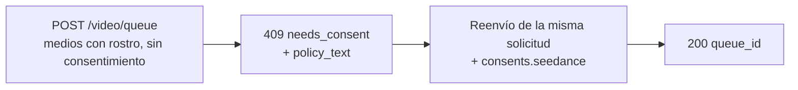

Los modelos de Seedance 2.0 imagen-a-video y referencia-a-video pueden generar un video a partir de un **rostro humano** que tú proporciones. Cuando la API de Venice detecta un rostro en los medios enviados, requiere una **atestación de consentimiento** única antes de procesar los medios. Es un requisito del proveedor para entradas con rostros y protege frente al uso no consentido de la imagen de personas.

Esta guía cubre exactamente qué enviar, qué recibes a cambio y cómo se gestionan las solicitudes recurrentes.

## Cuándo se aplica el consentimiento

El consentimiento solo se solicita cuando se cumplen **ambas** condiciones:

1. El modelo es una variante de Seedance que admite rostros:
   - `seedance-2-0-image-to-video`, `seedance-2-0-reference-to-video`
   - `seedance-2-0-fast-image-to-video`, `seedance-2-0-fast-reference-to-video`
2. Los medios enviados contienen realmente un rostro humano detectable, en cualquiera de estos campos: `image_url`, `end_image_url`, `reference_image_urls`, `reference_video_urls`.

Si **no hay rostro** en ninguno de esos campos, la solicitud sigue el flujo normal sin paso de consentimiento. Texto-a-video nunca entra en este flujo.

<Note>
El consentimiento no desbloquea contenido restringido. Un **menor detectado combinado con prompts sugerentes/NSFW**, o la **semejanza con una figura pública** reconocible, se rechaza como violación de política de contenido (`422`) y **no** puede aceptarse atestando consentimiento.
</Note>

## El flujo de dos llamadas



### Llamada 1 — enviar sin consentimiento

Envía tu solicitud de generación como siempre — sin campo de consentimiento:

```bash
curl -X POST https://api.venice.ai/api/v1/video/queue \
  -H "Authorization: Bearer $VENICE_API_KEY" \
  -H "Content-Type: application/json" \
  -d '{
    "model": "seedance-2-0-reference-to-video",
    "prompt": "Refer to <Subject 1> in <Image 1> to generate a 5-second clip of the same person walking through a sunlit market.",
    "reference_image_urls": ["https://example.com/person.jpg"],
    "duration": "5s",
    "aspect_ratio": "9:16",
    "resolution": "1080p"
  }'
```

Si se detecta un rostro y aún no has atestado, recibes un **`409`** sin cargo:

```json
{
  "error": {
    "code": "needs_consent",
    "message": "Seedance consent is required for this request."
  },
  "consent_flow": "seedance",
  "face_media_roles": ["reference_image"],
  "consent": {
    "consent_version": "v2.0",
    "policy_text": "The likeness in any media you upload is your own, or you have explicit, legal consent from any depicted individual(s). Note: an image may contain more than one face — your attestation covers all of them.\nYou own or have permission to use all media you uploaded for content generation.\nYou agree to the Venice.ai Terms of Service and Privacy Policy. Violations can lead to account suspension and legal liability.\nNo content is stored by Venice."
  },
  "docs_url": "https://docs.venice.ai/guides/media/seedance-face-consent"
}
```

| Campo | Significado |
|---|---|
| `face_media_roles` | Cuáles de tus entradas contienen un rostro: `image`, `end_image`, `reference_image`, `reference_video` |
| `consent.policy_text` | El texto exacto de la atestación que debes aceptar. Preséntalo a quien sea responsable de la solicitud. |
| `consent.consent_version` | La versión actual de la política (la fija el servidor; puede cambiar). Informativa — **no** la devuelves. |

No se cargan créditos ni pagos x402 en un `409`.

### Llamada 2 — reenviar con consentimiento

Reenvía el **mismo cuerpo de solicitud**, añadiendo un objeto `consents.seedance` con tres confirmaciones, todas `true`:

```bash
curl -X POST https://api.venice.ai/api/v1/video/queue \
  -H "Authorization: Bearer $VENICE_API_KEY" \
  -H "Content-Type: application/json" \
  -d '{
    "model": "seedance-2-0-reference-to-video",
    "prompt": "Refer to <Subject 1> in <Image 1> to generate a 5-second clip of the same person walking through a sunlit market.",
    "reference_image_urls": ["https://example.com/person.jpg"],
    "duration": "5s",
    "aspect_ratio": "9:16",
    "resolution": "1080p",
    "consents": {
      "seedance": {
        "confirmed_terms_and_privacy": true,
        "confirmed_legal_right": true,
        "confirmed_screening_acknowledged": true
      }
    }
  }'
```

Un envío correcto devuelve la respuesta de cola normal:

```json
{ "model": "seedance-2-0-reference-to-video", "queue_id": "..." }
```

Luego consulta `POST /api/v1/video/retrieve` con el `queue_id` como siempre (consulta [Generación de video](/es/guides/media/video-generation)).

## El objeto de consentimiento

```json
{
  "confirmed_terms_and_privacy": true,
  "confirmed_legal_right": true,
  "confirmed_screening_acknowledged": true
}
```

| Campo | Confirmas que… |
|---|---|
| `confirmed_terms_and_privacy` | aceptas el `policy_text` devuelto en el `409`, incluyendo los Términos de Servicio y la Política de Privacidad de Venice |
| `confirmed_legal_right` | la imagen es la tuya o tienes consentimiento legal explícito de cada persona representada |
| `confirmed_screening_acknowledged` | reconoces que los medios enviados pueden ser revisados automáticamente antes del procesamiento |

<Warning>
Los tres campos deben ser el booleano `true`. Cualquier campo faltante, un `false` o cualquier campo **extra** — incluido un `consent_version` — se rechaza con un `400`. La versión de la política la fija siempre el servidor; los clientes nunca envían ni eligen una versión.
</Warning>

## Solicitudes recurrentes (deduplicación)

Si envías **exactamente los mismos bytes de medios** que ya has atestado, la API lo reconoce y procede **sin** volver a pedir consentimiento — puedes omitir `consents.seedance` en envíos idénticos posteriores. La coincidencia es por bytes exactos de imagen: recodificar, redimensionar o recortar produce bytes distintos y volverá a pedir consentimiento.

Una coincidencia parcial (una entrada ya atestada más una nueva entrada con rostro) sigue requiriendo un `consents.seedance` nuevo en el envío.

## Revocación

Para revocar el consentimiento y borrar los activos faciales almacenados, inicia sesión en la web de Venice (**Settings**). La revocación no está disponible a través de la API pública. Tras revocar, la próxima solicitud que use esos medios volverá a pedir consentimiento.

## Pago

La decisión de consentimiento siempre ocurre **antes** de cualquier cobro, en ambos métodos de pago:

- **API key:** el `409`/`422` se devuelve antes del cargo de créditos; nada se factura por una solicitud bloqueada.
- **x402:** el cargo de consumo se ejecuta solo tras una generación exitosa, por lo que un `409`/`422` no liquida nada. Reenvía con consentimiento (y una nueva autorización x402) para continuar.

## Referencia de errores

| Estado | Body `error` | Causa |
|---|---|---|
| `409` | `needs_consent` | Rostro detectado, sin un `consents.seedance` válido y sin coincidencia exacta de medios. Reenvía con consentimiento. |
| `400` | error de validación | `consents.seedance` mal formado — confirmación faltante/`false` o campo extra como `consent_version`. |
| `422` | `CONTENT_POLICY_VIOLATION` | Menor detectado con contenido sugerente/NSFW, o semejanza con figura pública. El consentimiento no lo anula. |
| `422` | `IMAGE_ASPECT_RATIO_OUT_OF_BOUNDS` | Una **imagen con rostro detectado** está fuera del ratio ancho/alto permitido `(0.4, 2.5)`. Se comprueba de forma síncrona durante el aprovisionamiento del activo facial (antes del cobro); solo aplica una vez detectado un rostro en esa imagen. |

## Referencias

- Endpoint de cola de video: [`POST /api/v1/video/queue`](/es/api-reference/endpoint/video/queue)
- [Guía de Seedance 2.0](/es/guides/media/seedance-2-0) — variantes, flujos, sintaxis del prompt, límites
- [Generación de video](/es/guides/media/video-generation) — visión general de cola / sondeo
