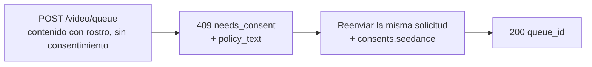

Los modelos image- y reference-to-video de Seedance 2.0 pueden generar un vídeo a partir de un **rostro humano** que tú proporciones. Cuando la API de Venice detecta un rostro en el contenido enviado, requiere una **atestación de consentimiento** única antes de procesar el contenido. Es un requisito del proveedor para entradas con rostros y protege contra usos no consensuados de la imagen de una persona.

Esta guía cubre exactamente qué envías, qué recibes y cómo se gestionan las solicitudes recurrentes.

## Cuándo se aplica el consentimiento

El consentimiento solo se solicita cuando **se cumplen ambas** condiciones:

1. El modelo es una variante de Seedance elegible para rostros:
   - `seedance-2-0-image-to-video`, `seedance-2-0-reference-to-video`
   - `seedance-2-0-fast-image-to-video`, `seedance-2-0-fast-reference-to-video`
2. El contenido enviado contiene efectivamente un rostro humano detectable, en cualquiera de estos campos: `image_url`, `end_image_url`, `reference_image_urls`, `reference_video_urls`.

Si **no hay rostro** en ninguno de esos campos, la solicitud continúa con normalidad sin paso de consentimiento. Text-to-video nunca entra en este flujo.

<Note>
El consentimiento no desbloquea contenido restringido. Un **menor detectado combinado con prompts sugerentes/NSFW**, o una imagen reconocible de una **figura pública**, se rechazan como infracción de la política de contenido (`422`) y **no** pueden hacerse aceptables atestando consentimiento.
</Note>

## El flujo de dos llamadas



### Llamada 1 — envía sin consentimiento

Envía tu solicitud de generación como de costumbre, sin campo de consentimiento:

```bash
curl -X POST https://api.venice.ai/api/v1/video/queue \
  -H "Authorization: Bearer $VENICE_API_KEY" \
  -H "Content-Type: application/json" \
  -d '{
    "model": "seedance-2-0-reference-to-video",
    "prompt": "Refer to <Subject 1> in <Image 1> to generate a 5-second clip of the same person walking through a sunlit market.",
    "reference_image_urls": ["https://example.com/person.jpg"],
    "duration": "5s",
    "aspect_ratio": "9:16",
    "resolution": "1080p"
  }'
```

Si se detecta un rostro y aún no has atestiguado, obtienes un **`409`** sin cargo:

```json
{
  "error": {
    "code": "needs_consent",
    "message": "Seedance consent is required for this request."
  },
  "consent_flow": "seedance",
  "face_media_roles": ["reference_image"],
  "consent": {
    "consent_version": "v2.0",
    "policy_text": "The likeness in any media you upload is your own, or you have explicit, legal consent from any depicted individual(s). Note: an image may contain more than one face — your attestation covers all of them.\nYou own or have permission to use all media you uploaded for content generation.\nYou agree to the Venice.ai Terms of Service and Privacy Policy. Violations can lead to account suspension and legal liability.\nNo content is stored by Venice."
  },
  "docs_url": "https://docs.venice.ai/guides/media/seedance-face-consent"
}
```

| Campo | Significado |
|---|---|
| `face_media_roles` | Qué entradas tuyas contienen un rostro: `image`, `end_image`, `reference_image`, `reference_video` |
| `consent.policy_text` | El texto exacto de atestación con el que debes estar de acuerdo. Preséntalo a quien sea responsable de la solicitud. |
| `consent.consent_version` | La versión actual de la política (establecida por el servidor; puede cambiar con el tiempo). Informativo — **no** lo envías de vuelta. |

No se cobran créditos ni pago x402 en un `409`.

### Llamada 2 — reenviar con consentimiento

Reenvía el **mismo cuerpo de solicitud** añadiendo un objeto `consents.seedance` con tres confirmaciones, todas en `true`:

```bash
curl -X POST https://api.venice.ai/api/v1/video/queue \
  -H "Authorization: Bearer $VENICE_API_KEY" \
  -H "Content-Type: application/json" \
  -d '{
    "model": "seedance-2-0-reference-to-video",
    "prompt": "Refer to <Subject 1> in <Image 1> to generate a 5-second clip of the same person walking through a sunlit market.",
    "reference_image_urls": ["https://example.com/person.jpg"],
    "duration": "5s",
    "aspect_ratio": "9:16",
    "resolution": "1080p",
    "consents": {
      "seedance": {
        "confirmed_terms_and_privacy": true,
        "confirmed_legal_right": true,
        "confirmed_screening_acknowledged": true
      }
    }
  }'
```

Un envío correcto devuelve la respuesta normal de la cola:

```json
{ "model": "seedance-2-0-reference-to-video", "queue_id": "..." }
```

A continuación, consulta `POST /api/v1/video/retrieve` con el `queue_id` como de costumbre (consulta [Generación de vídeo](/guides/media/video-generation)).

## El objeto de consentimiento

```json
{
  "confirmed_terms_and_privacy": true,
  "confirmed_legal_right": true,
  "confirmed_screening_acknowledged": true
}
```

| Campo | Confirmas que… |
|---|---|
| `confirmed_terms_and_privacy` | aceptas el `policy_text` devuelto en el `409`, incluyendo los Términos de servicio y la Política de privacidad de Venice |
| `confirmed_legal_right` | la imagen es tuya o cuentas con consentimiento explícito y legal de cada persona representada |
| `confirmed_screening_acknowledged` | reconoces que el contenido enviado puede ser examinado automáticamente antes de procesarse |

<Warning>
Los tres campos deben ser el booleano `true`. Cualquier campo faltante, un `false`, o cualquier campo **adicional** — incluido un `consent_version` — se rechaza con un `400`. La versión de la política siempre la establece el servidor; los clientes nunca envían ni eligen una versión.
</Warning>

## Solicitudes recurrentes (dedupe)

Si envías **los mismos bytes exactos de contenido** para los que ya has atestiguado, la API lo reconoce y continúa **sin** pedir consentimiento de nuevo — puedes omitir `consents.seedance` en envíos idénticos posteriores. Esta coincidencia es por bytes exactos: recodificar, redimensionar o recortar produce bytes diferentes y volverá a pedir consentimiento.

Una coincidencia parcial (una entrada previamente atestiguada más una nueva entrada con rostro) sigue requiriendo un nuevo `consents.seedance` en el nuevo envío.

## Revocación

Para revocar el consentimiento y borrar los activos faciales almacenados, inicia sesión en la web de Venice (**Settings**). La revocación no está disponible mediante la API pública. Tras la revocación, la siguiente solicitud que use ese contenido pedirá consentimiento de nuevo.

## Pago

La decisión de consentimiento siempre ocurre **antes** de cualquier cargo, para ambos métodos de pago:

- **API key:** un `409`/`422` se devuelve antes del cargo de créditos; no se factura nada para una solicitud bloqueada.
- **x402:** el cargo de consumo se realiza solo tras una generación correcta, por lo que un `409`/`422` no liquida nada. Vuelve a enviar con consentimiento (y una nueva autorización x402) para continuar.

## Referencia de errores

| Estado | `error` del cuerpo | Causa |
|---|---|---|
| `409` | `needs_consent` | Rostro detectado, sin `consents.seedance` válido, sin coincidencia exacta de contenido. Reenvía con consentimiento. |
| `400` | error de validación | `consents.seedance` mal formado — una confirmación ausente/`false` o un campo adicional como `consent_version`. |
| `422` | `CONTENT_POLICY_VIOLATION` | Menor detectado con contenido sugerente/NSFW, o imagen de figura pública. El consentimiento no anula esto. |
| `422` | `IMAGE_ASPECT_RATIO_OUT_OF_BOUNDS` | Una **imagen con rostro detectado** está fuera de la relación ancho/alto permitida `(0.4, 2.5)`. Comprobado de forma sincrónica durante el aprovisionamiento del activo facial (antes del cargo); solo aplica cuando se detecta un rostro en esa imagen. |

## Referencias

- Endpoint de cola de vídeo: [`POST /api/v1/video/queue`](/api-reference/endpoint/video/queue)
- [Guía de Seedance 2.0](/guides/media/seedance-2-0) — variantes, flujos, sintaxis de prompts, límites
- [Generación de vídeo](/guides/media/video-generation) — visión general de cola y polling
