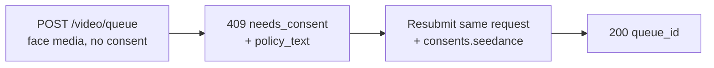

Los modelos image- y reference-to-video de Seedance 2.0 pueden impulsar un video a partir de un **rostro humano** que tú proporciones. Cuando la API de Venice detecta un rostro en los medios que envías, requiere una **atestación de consentimiento** única antes de procesar el medio. Este es un requisito del proveedor para las entradas con rostros y protege contra el uso no consentido del parecido físico.

Esta guía cubre exactamente qué envías, qué recibes de vuelta y cómo se manejan las solicitudes recurrentes.

## Cuándo aplica el consentimiento

El consentimiento solo se solicita cuando **ambas** condiciones son ciertas:

1. El modelo es una variante de Seedance apta para rostros:
   - `seedance-2-0-image-to-video`, `seedance-2-0-reference-to-video`
   - `seedance-2-0-fast-image-to-video`, `seedance-2-0-fast-reference-to-video`
2. El medio enviado contiene efectivamente un rostro humano detectable, en cualquiera de estos campos: `image_url`, `end_image_url`, `reference_image_urls`, `reference_video_urls`.

Si **no hay ningún rostro** en ninguno de esos campos, la solicitud continúa normalmente sin ningún paso de consentimiento. El text-to-video nunca entra en este flujo.

<Note>
El consentimiento no desbloquea contenido restringido. Un **menor detectado combinado con prompts sexualmente sugerentes o NSFW**, o un **parecido reconocible de una figura pública**, se rechazan como una violación de la política de contenido (`422`) y **no** pueden hacerse aceptables mediante la atestación de consentimiento.
</Note>

## El flujo de dos llamadas


```mermaid
flowchart LR
  A[POST /video/queue<br/>face media, no consent] --> B[409 needs_consent<br/>+ policy_text]
  B --> C[Resubmit same request<br/>+ consents.seedance]
  C --> D[200 queue_id]
```

### Llamada 1 — envío sin consentimiento

Envía tu solicitud de generación como de costumbre, sin campo de consentimiento:

```bash
curl -X POST https://api.venice.ai/api/v1/video/queue \
  -H "Authorization: Bearer $VENICE_API_KEY" \
  -H "Content-Type: application/json" \
  -d '{
    "model": "seedance-2-0-reference-to-video",
    "prompt": "Refer to <Subject 1> in <Image 1> to generate a 5-second clip of the same person walking through a sunlit market.",
    "reference_image_urls": ["https://example.com/person.jpg"],
    "duration": "5s",
    "aspect_ratio": "9:16",
    "resolution": "1080p"
  }'
```

Si se detecta un rostro y aún no has atestado, recibes un **`409`** sin cargo:

```json
{
  "error": {
    "code": "needs_consent",
    "message": "Seedance consent is required for this request."
  },
  "consent_flow": "seedance",
  "face_media_roles": ["reference_image"],
  "consent": {
    "consent_version": "v2.0",
    "policy_text": "The likeness in any media you upload is your own, or you have explicit, legal consent from any depicted individual(s). Note: an image may contain more than one face — your attestation covers all of them.\nYou own or have permission to use all media you uploaded for content generation.\nYou agree to the Venice.ai Terms of Service and Privacy Policy. Violations can lead to account suspension and legal liability.\nNo content is stored by Venice."
  },
  "docs_url": "https://docs.venice.ai/guides/media/seedance-face-consent"
}
```

| Campo | Significado |
|---|---|
| `face_media_roles` | Cuáles de tus entradas contienen un rostro: `image`, `end_image`, `reference_image`, `reference_video` |
| `consent.policy_text` | El texto exacto de la atestación al que debes aceptar. Preséntalo a quien sea responsable de la solicitud. |
| `consent.consent_version` | La versión actual de la política (establecida por el servidor; puede cambiar con el tiempo). Informativa; **no** la envías de vuelta. |

No se cobran créditos ni pagos x402 en un `409`.

### Llamada 2 — reenvío con consentimiento

Reenvía el **mismo cuerpo de solicitud**, añadiendo un objeto `consents.seedance` con tres confirmaciones, todas en `true`:

```bash
curl -X POST https://api.venice.ai/api/v1/video/queue \
  -H "Authorization: Bearer $VENICE_API_KEY" \
  -H "Content-Type: application/json" \
  -d '{
    "model": "seedance-2-0-reference-to-video",
    "prompt": "Refer to <Subject 1> in <Image 1> to generate a 5-second clip of the same person walking through a sunlit market.",
    "reference_image_urls": ["https://example.com/person.jpg"],
    "duration": "5s",
    "aspect_ratio": "9:16",
    "resolution": "1080p",
    "consents": {
      "seedance": {
        "confirmed_terms_and_privacy": true,
        "confirmed_legal_right": true,
        "confirmed_screening_acknowledged": true
      }
    }
  }'
```

Un envío exitoso devuelve la respuesta normal de la cola:

```json
{ "model": "seedance-2-0-reference-to-video", "queue_id": "..." }
```

Después consulta `POST /api/v1/video/retrieve` con el `queue_id` como de costumbre (consulta [Generación de video](/guides/media/video-generation)).

## El objeto de consentimiento

```json
{
  "confirmed_terms_and_privacy": true,
  "confirmed_legal_right": true,
  "confirmed_screening_acknowledged": true
}
```

| Campo | Confirmas que… |
|---|---|
| `confirmed_terms_and_privacy` | aceptas el `policy_text` devuelto en el `409`, incluidos los Términos de Servicio y la Política de Privacidad de Venice |
| `confirmed_legal_right` | el parecido es el tuyo propio o tienes consentimiento explícito y legal de cada individuo representado |
| `confirmed_screening_acknowledged` | reconoces que los medios enviados pueden ser filtrados automáticamente antes de su procesamiento |

<Warning>
Los tres campos deben ser el booleano `true`. Cualquier campo faltante, un `false` o cualquier campo **adicional**, incluido `consent_version`, se rechaza con un `400`. La versión de la política siempre la establece el servidor; los clientes nunca envían ni eligen una versión.
</Warning>

## Solicitudes recurrentes (deduplicación)

Si envías **exactamente los mismos bytes de medios** para los que ya has atestado, la API los reconoce y continúa **sin** volver a pedir consentimiento; puedes omitir `consents.seedance` en envíos idénticos posteriores. Esta coincidencia es por bytes de imagen exactos: re-codificar, redimensionar o recortar produce bytes distintos y volverá a solicitar consentimiento.

Una coincidencia parcial (una entrada previamente atestada más una nueva entrada con rostro) todavía requiere un `consents.seedance` nuevo en el nuevo envío.

## Revocación

Para revocar el consentimiento y borrar los face-assets almacenados, inicia sesión en la app web de Venice (**Settings**). La revocación no está disponible a través de la API pública. Después de revocar, la siguiente solicitud que use ese medio volverá a solicitar consentimiento.

## Pago

La decisión de consentimiento siempre ocurre **antes** de cualquier cargo, para ambos métodos de pago:

- **Clave de API:** un `409`/`422` se devuelve antes del cargo de créditos; nada se factura por una solicitud bloqueada.
- **x402:** el cargo por consumo se ejecuta solo tras una generación exitosa, por lo que un `409`/`422` no liquida nada. Reenvía con consentimiento (y una nueva autorización x402) para continuar.

## Referencia de errores

| Estado | `error` del cuerpo | Causa |
|---|---|---|
| `409` | `needs_consent` | Rostro detectado, sin un `consents.seedance` válido, sin coincidencia exacta de medios. Reenvía con consentimiento. |
| `400` | error de validación | `consents.seedance` mal formado: una confirmación faltante o `false`, o un campo adicional como `consent_version`. |
| `422` | `CONTENT_POLICY_VIOLATION` | Menor detectado con contenido sugerente/NSFW, o parecido de una figura pública. El consentimiento no lo anula. |
| `422` | `IMAGE_ASPECT_RATIO_OUT_OF_BOUNDS` | Una **imagen con rostro detectado** está fuera de la relación ancho/alto permitida `(0.4, 2.5)`. Se verifica de forma síncrona durante el aprovisionamiento de face-assets (antes del cargo); solo aplica una vez que se detecta un rostro en esa imagen. |

## Referencias

- Endpoint de la cola de video: [`POST /api/v1/video/queue`](/api-reference/endpoint/video/queue)
- [Guía de Seedance 2.0](/guides/media/seedance-2-0): variantes, flujos de trabajo, sintaxis de prompts, límites
- [Generación de video](/guides/media/video-generation): resumen de cola y sondeo
