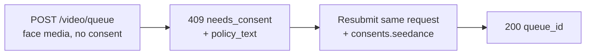

Les modèles Seedance 2.0 image-to-video et reference-to-video peuvent animer une vidéo à partir d'un **visage humain** que vous fournissez. Lorsque l'API Venice détecte un visage dans votre média soumis, elle requiert une **attestation de consentement** unique avant que le média ne soit traité. Il s'agit d'une exigence du fournisseur pour les entrées contenant des visages et cela protège contre l'utilisation non consentie de l'image d'une personne.

Ce guide couvre exactement ce que vous envoyez, ce que vous recevez en retour et comment les requêtes répétées sont gérées.

## Quand le consentement s'applique

Le consentement n'est demandé que lorsque **les deux** conditions sont vraies :

1. Le modèle est une variante Seedance éligible aux visages :
   - `seedance-2-0-image-to-video`, `seedance-2-0-reference-to-video`
   - `seedance-2-0-fast-image-to-video`, `seedance-2-0-fast-reference-to-video`
2. Le média soumis contient effectivement un visage humain détectable, dans l'un de ces champs : `image_url`, `end_image_url`, `reference_image_urls`, `reference_video_urls`.

S'il n'y a **aucun visage** dans aucun de ces champs, la requête se déroule normalement sans étape de consentement. Text-to-video n'entre jamais dans ce flux.

<Note>
Le consentement ne débloque pas le contenu restreint. Un **mineur détecté combiné à des prompts à connotation sexuelle/NSFW**, ou la ressemblance d'une **personnalité publique** reconnaissable, est rejeté comme une violation de la politique de contenu (`422`) et **ne peut pas** être rendu acceptable en attestant le consentement.
</Note>

## Le flux à deux appels



### Appel 1 — soumettre sans consentement

Soumettez votre requête de génération comme d'habitude — pas de champ de consentement :

```bash
curl -X POST https://api.venice.ai/api/v1/video/queue \
  -H "Authorization: Bearer $VENICE_API_KEY" \
  -H "Content-Type: application/json" \
  -d '{
    "model": "seedance-2-0-reference-to-video",
    "prompt": "Refer to <Subject 1> in <Image 1> to generate a 5-second clip of the same person walking through a sunlit market.",
    "reference_image_urls": ["https://example.com/person.jpg"],
    "duration": "5s",
    "aspect_ratio": "9:16",
    "resolution": "1080p"
  }'
```

Si un visage est détecté et que vous n'avez pas encore attesté, vous obtenez un **`409`** non facturé :

```json
{
  "error": {
    "code": "needs_consent",
    "message": "Seedance consent is required for this request."
  },
  "consent_flow": "seedance",
  "face_media_roles": ["reference_image"],
  "consent": {
    "consent_version": "v2.0",
    "policy_text": "The likeness in any media you upload is your own, or you have explicit, legal consent from any depicted individual(s). Note: an image may contain more than one face — your attestation covers all of them.\nYou own or have permission to use all media you uploaded for content generation.\nYou agree to the Venice.ai Terms of Service and Privacy Policy. Violations can lead to account suspension and legal liability.\nNo content is stored by Venice."
  },
  "docs_url": "https://docs.venice.ai/guides/media/seedance-face-consent"
}
```

| Champ | Signification |
|---|---|
| `face_media_roles` | Lesquelles de vos entrées contiennent un visage : `image`, `end_image`, `reference_image`, `reference_video` |
| `consent.policy_text` | Le texte exact de l'attestation que vous devez accepter. Présentez-le à toute personne responsable de la requête. |
| `consent.consent_version` | La version actuelle de la politique (définie par le serveur ; peut changer dans le temps). Informationnel — vous ne le renvoyez **pas**. |

Aucun crédit ni paiement x402 n'est facturé sur un `409`.

### Appel 2 — resoumettre avec consentement

Renvoyez **le même corps de requête**, en ajoutant un objet `consents.seedance` avec trois confirmations, toutes à `true` :

```bash
curl -X POST https://api.venice.ai/api/v1/video/queue \
  -H "Authorization: Bearer $VENICE_API_KEY" \
  -H "Content-Type: application/json" \
  -d '{
    "model": "seedance-2-0-reference-to-video",
    "prompt": "Refer to <Subject 1> in <Image 1> to generate a 5-second clip of the same person walking through a sunlit market.",
    "reference_image_urls": ["https://example.com/person.jpg"],
    "duration": "5s",
    "aspect_ratio": "9:16",
    "resolution": "1080p",
    "consents": {
      "seedance": {
        "confirmed_terms_and_privacy": true,
        "confirmed_legal_right": true,
        "confirmed_screening_acknowledged": true
      }
    }
  }'
```

Une soumission réussie renvoie la réponse de file d'attente normale :

```json
{ "model": "seedance-2-0-reference-to-video", "queue_id": "..." }
```

Ensuite, interrogez `POST /api/v1/video/retrieve` avec le `queue_id` comme d'habitude (voir [Génération vidéo](/guides/media/video-generation)).

## L'objet de consentement

```json
{
  "confirmed_terms_and_privacy": true,
  "confirmed_legal_right": true,
  "confirmed_screening_acknowledged": true
}
```

| Champ | Vous confirmez que… |
|---|---|
| `confirmed_terms_and_privacy` | vous acceptez le `policy_text` renvoyé dans le `409`, y compris les conditions de service et la politique de confidentialité de Venice |
| `confirmed_legal_right` | la ressemblance est la vôtre ou vous avez un consentement légal explicite de chaque personne représentée |
| `confirmed_screening_acknowledged` | vous reconnaissez que le média soumis peut être automatiquement filtré avant traitement |

<Warning>
Les trois champs doivent être le booléen `true`. Tout champ manquant, à `false` ou tout champ **supplémentaire** — y compris un `consent_version` — est rejeté avec un `400`. La version de la politique est toujours définie par le serveur ; les clients n'envoient ni ne choisissent jamais une version.
</Warning>

## Requêtes répétées (déduplication)

Si vous soumettez **exactement les mêmes octets de média** que vous avez déjà attestés, l'API le reconnaît et procède **sans** demander à nouveau le consentement — vous pouvez omettre `consents.seedance` lors des soumissions identiques ultérieures. Cette correspondance se fait par octets d'image exacts : ré-encoder, redimensionner ou recadrer produit des octets différents et redéclenchera la demande de consentement.

Une correspondance partielle (une entrée précédemment attestée plus une nouvelle entrée avec visage) nécessite encore un nouveau `consents.seedance` sur la nouvelle soumission.

## Révocation

Pour révoquer le consentement et effacer les éléments de visage stockés, connectez-vous à l'application web Venice (**Settings**). La révocation n'est pas disponible via l'API publique. Après révocation, la prochaine requête utilisant ce média redéclenchera la demande de consentement.

## Paiement

La décision de consentement intervient toujours **avant** toute facturation, pour les deux méthodes de paiement :

- **Clé API :** un `409`/`422` est renvoyé avant la facturation du crédit ; rien n'est facturé pour une requête bloquée.
- **x402 :** la facturation de la consommation ne s'exécute qu'après une génération réussie, donc un `409`/`422` ne règle rien. Resoumettez avec consentement (et une nouvelle autorisation x402) pour continuer.

## Référence des erreurs

| Statut | `error` du corps | Cause |
|---|---|---|
| `409` | `needs_consent` | Visage détecté, pas de `consents.seedance` valide, pas de correspondance exacte de média. Resoumettez avec consentement. |
| `400` | erreur de validation | `consents.seedance` mal formé — une confirmation manquante/`false` ou un champ supplémentaire comme `consent_version`. |
| `422` | `CONTENT_POLICY_VIOLATION` | Mineur détecté avec contenu suggestif/NSFW, ou ressemblance avec une personnalité publique. Le consentement ne contourne pas cela. |
| `422` | `IMAGE_ASPECT_RATIO_OUT_OF_BOUNDS` | Une **image avec visage détecté** est en dehors du ratio largeur/hauteur autorisé `(0.4, 2.5)`. Vérifié de manière synchrone pendant le provisionnement de l'élément de visage (avant facturation) ; ne s'applique qu'une fois qu'un visage est détecté dans cette image. |

## Références

- Endpoint de file d'attente vidéo : [`POST /api/v1/video/queue`](/api-reference/endpoint/video/queue)
- [Guide Seedance 2.0](/guides/media/seedance-2-0) — variantes, workflows, syntaxe de prompt, limites
- [Génération vidéo](/guides/media/video-generation) — aperçu de la file d'attente / polling
