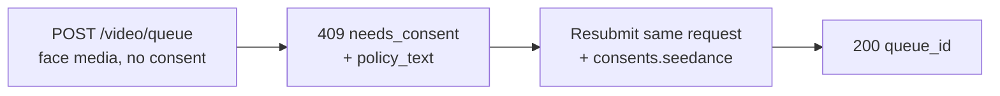

Les modèles image- et reference-to-video de Seedance 2.0 peuvent piloter une vidéo à partir d'un **visage humain** que vous fournissez. Lorsque l'API Venice détecte un visage dans les médias que vous soumettez, elle exige une **attestation de consentement** unique avant de traiter les médias. Il s'agit d'une exigence du fournisseur pour les entrées comportant un visage et cela protège contre l'utilisation non consentie de la ressemblance.

Ce guide décrit exactement ce que vous envoyez, ce que vous recevez en retour et comment sont gérées les requêtes récurrentes.

## Quand le consentement s'applique

Le consentement n'est demandé que lorsque **les deux** conditions suivantes sont réunies :

1. Le modèle est une variante Seedance éligible aux visages :
   - `seedance-2-0-image-to-video`, `seedance-2-0-reference-to-video`
   - `seedance-2-0-fast-image-to-video`, `seedance-2-0-fast-reference-to-video`
2. Les médias soumis contiennent effectivement un visage humain détectable, dans l'un des champs suivants : `image_url`, `end_image_url`, `reference_image_urls`, `reference_video_urls`.

S'il n'y a **aucun visage** dans ces champs, la requête se poursuit normalement, sans étape de consentement. Le text-to-video n'entre jamais dans ce flux.

<Note>
Le consentement ne débloque pas de contenu restreint. La détection d'un **mineur combinée à des prompts à caractère sexuel/NSFW**, ou d'une ressemblance de **personnalité publique** reconnaissable, est rejetée en tant que violation de la politique de contenu (`422`) et **ne peut pas** être rendue acceptable en attestant un consentement.
</Note>

## Le flux en deux appels


```mermaid
flowchart LR
  A[POST /video/queue<br/>face media, no consent] --> B[409 needs_consent<br/>+ policy_text]
  B --> C[Resubmit same request<br/>+ consents.seedance]
  C --> D[200 queue_id]
```

### Appel 1 : soumettre sans consentement

Soumettez votre requête de génération comme d'habitude, sans champ de consentement :

```bash
curl -X POST https://api.venice.ai/api/v1/video/queue \
  -H "Authorization: Bearer $VENICE_API_KEY" \
  -H "Content-Type: application/json" \
  -d '{
    "model": "seedance-2-0-reference-to-video",
    "prompt": "Refer to <Subject 1> in <Image 1> to generate a 5-second clip of the same person walking through a sunlit market.",
    "reference_image_urls": ["https://example.com/person.jpg"],
    "duration": "5s",
    "aspect_ratio": "9:16",
    "resolution": "1080p"
  }'
```

Si un visage est détecté et que vous n'avez pas encore attesté, vous obtenez un **`409`** non facturé :

```json
{
  "error": {
    "code": "needs_consent",
    "message": "Seedance consent is required for this request."
  },
  "consent_flow": "seedance",
  "face_media_roles": ["reference_image"],
  "consent": {
    "consent_version": "v2.0",
    "policy_text": "The likeness in any media you upload is your own, or you have explicit, legal consent from any depicted individual(s). Note: an image may contain more than one face — your attestation covers all of them.\nYou own or have permission to use all media you uploaded for content generation.\nYou agree to the Venice.ai Terms of Service and Privacy Policy. Violations can lead to account suspension and legal liability.\nNo content is stored by Venice."
  },
  "docs_url": "https://docs.venice.ai/guides/media/seedance-face-consent"
}
```

| Champ | Signification |
|---|---|
| `face_media_roles` | Lesquelles de vos entrées contiennent un visage : `image`, `end_image`, `reference_image`, `reference_video` |
| `consent.policy_text` | Le texte exact d'attestation que vous devez accepter. Présentez-le à la personne responsable de la requête. |
| `consent.consent_version` | La version actuelle de la politique (définie par le serveur ; peut évoluer avec le temps). À titre informatif. Vous ne la renvoyez **pas**. |

Aucun crédit ni paiement x402 n'est facturé sur un `409`.

### Appel 2 : soumettre à nouveau avec consentement

Renvoyez le **même corps de requête**, en ajoutant un objet `consents.seedance` avec trois confirmations, toutes à `true` :

```bash
curl -X POST https://api.venice.ai/api/v1/video/queue \
  -H "Authorization: Bearer $VENICE_API_KEY" \
  -H "Content-Type: application/json" \
  -d '{
    "model": "seedance-2-0-reference-to-video",
    "prompt": "Refer to <Subject 1> in <Image 1> to generate a 5-second clip of the same person walking through a sunlit market.",
    "reference_image_urls": ["https://example.com/person.jpg"],
    "duration": "5s",
    "aspect_ratio": "9:16",
    "resolution": "1080p",
    "consents": {
      "seedance": {
        "confirmed_terms_and_privacy": true,
        "confirmed_legal_right": true,
        "confirmed_screening_acknowledged": true
      }
    }
  }'
```

Une soumission réussie renvoie la réponse de file d'attente habituelle :

```json
{ "model": "seedance-2-0-reference-to-video", "queue_id": "..." }
```

Ensuite, interrogez `POST /api/v1/video/retrieve` avec le `queue_id` comme d'habitude (voir [Video Generation](/guides/media/video-generation)).

## L'objet de consentement

```json
{
  "confirmed_terms_and_privacy": true,
  "confirmed_legal_right": true,
  "confirmed_screening_acknowledged": true
}
```

| Champ | Vous confirmez que… |
|---|---|
| `confirmed_terms_and_privacy` | vous acceptez le `policy_text` renvoyé dans le `409`, y compris les Conditions d'utilisation et la Politique de confidentialité de Venice |
| `confirmed_legal_right` | la ressemblance est la vôtre ou vous disposez du consentement explicite et légal de chaque personne représentée |
| `confirmed_screening_acknowledged` | vous reconnaissez que les médias soumis peuvent être filtrés automatiquement avant traitement |

<Warning>
Les trois champs doivent être le booléen `true`. Tout champ manquant, une valeur `false`, ou tout champ **supplémentaire**, y compris un `consent_version`, est rejeté avec un `400`. La version de la politique est toujours définie par le serveur ; les clients n'envoient jamais et ne choisissent jamais de version.
</Warning>

## Requêtes récurrentes (déduplication)

Si vous soumettez **exactement les mêmes octets de média** que ceux pour lesquels vous avez déjà attesté, l'API le reconnaît et poursuit **sans** redemander de consentement. Vous pouvez omettre `consents.seedance` lors des soumissions ultérieures identiques. La correspondance porte sur des octets d'image identiques : ré-encoder, redimensionner ou recadrer produit des octets différents et déclenchera à nouveau la demande de consentement.

Une correspondance partielle (une entrée déjà attestée plus une nouvelle entrée avec visage) exige tout de même un nouveau `consents.seedance` sur la nouvelle soumission.

## Révocation

Pour révoquer le consentement et effacer les actifs de visage stockés, connectez-vous à l'application web Venice (**Paramètres**). La révocation n'est pas disponible via l'API publique. Après révocation, la requête suivante utilisant ces médias demandera à nouveau un consentement.

## Paiement

La décision de consentement se produit toujours **avant** toute facturation, pour les deux méthodes de paiement :

- **Clé d'API :** un `409` / `422` est renvoyé avant le débit de crédit ; rien n'est facturé pour une requête bloquée.
- **x402 :** la facturation de la consommation ne s'exécute qu'après une génération réussie, donc un `409` / `422` ne règle rien. Soumettez à nouveau avec le consentement (et une nouvelle autorisation x402) pour continuer.

## Référence des erreurs

| Statut | Corps `error` | Cause |
|---|---|---|
| `409` | `needs_consent` | Visage détecté, aucun `consents.seedance` valide, aucune correspondance exacte de média. Soumettez à nouveau avec le consentement. |
| `400` | erreur de validation | `consents.seedance` mal formé : une confirmation manquante / `false` ou un champ supplémentaire tel que `consent_version`. |
| `422` | `CONTENT_POLICY_VIOLATION` | Mineur détecté avec contenu à caractère sexuel / NSFW, ou ressemblance de personnalité publique. Le consentement ne l'emporte pas dans ce cas. |
| `422` | `IMAGE_ASPECT_RATIO_OUT_OF_BOUNDS` | Une **image dont un visage a été détecté** est en dehors du rapport largeur/hauteur autorisé `(0.4, 2.5)`. Vérifié de manière synchrone lors du provisionnement de l'actif de visage (avant facturation) ; ne s'applique qu'une fois un visage détecté dans cette image. |

## Références

- Endpoint de file vidéo : [`POST /api/v1/video/queue`](/api-reference/endpoint/video/queue)
- [Guide Seedance 2.0](/guides/media/seedance-2-0) : variantes, flux, syntaxe des prompts, limites
- [Video Generation](/guides/media/video-generation) : vue d'ensemble de la file / interrogation
