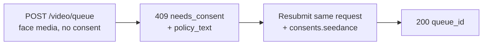

I modelli image- e reference-to-video di Seedance 2.0 possono pilotare un video da un **volto umano** che fornisci. Quando l'API Venice rileva un volto nel media inviato, richiede un'**attestazione di consenso** una tantum prima che il media venga elaborato. Questo è un requisito del provider per gli input con volti e protegge contro l'uso non consensuale dell'immagine.

Questa guida copre esattamente cosa invii, cosa ricevi indietro e come vengono gestite le richieste successive.

## Quando si applica il consenso

Il consenso viene richiesto solo quando **entrambe** le condizioni sono vere:

1. Il modello è una variante Seedance ammissibile a volti:
   - `seedance-2-0-image-to-video`, `seedance-2-0-reference-to-video`
   - `seedance-2-0-fast-image-to-video`, `seedance-2-0-fast-reference-to-video`
2. Il media inviato contiene effettivamente un volto umano rilevabile, in uno qualunque di questi campi: `image_url`, `end_image_url`, `reference_image_urls`, `reference_video_urls`.

Se **non c'è nessun volto** in alcuno di quei campi, la richiesta procede normalmente senza lo step di consenso. Il text-to-video non entra mai in questo flusso.

<Note>
Il consenso non sblocca contenuti vietati. Un **minore rilevato combinato con prompt sessualmente suggestivi/NSFW**, o una **somiglianza con una figura pubblica** riconoscibile, viene rifiutato come violazione della content policy (`422`) e **non può** essere reso accettabile attestando il consenso.
</Note>

## Il flusso a due chiamate



### Chiamata 1 — invia senza consenso

Invia la tua richiesta di generazione come al solito — nessun campo consent:

```bash
curl -X POST https://api.venice.ai/api/v1/video/queue \
  -H "Authorization: Bearer $VENICE_API_KEY" \
  -H "Content-Type: application/json" \
  -d '{
    "model": "seedance-2-0-reference-to-video",
    "prompt": "Refer to <Subject 1> in <Image 1> to generate a 5-second clip of the same person walking through a sunlit market.",
    "reference_image_urls": ["https://example.com/person.jpg"],
    "duration": "5s",
    "aspect_ratio": "9:16",
    "resolution": "1080p"
  }'
```

Se viene rilevato un volto e non hai ancora attestato, ricevi un **`409`** senza addebito:

```json
{
  "error": {
    "code": "needs_consent",
    "message": "Seedance consent is required for this request."
  },
  "consent_flow": "seedance",
  "face_media_roles": ["reference_image"],
  "consent": {
    "consent_version": "v2.0",
    "policy_text": "The likeness in any media you upload is your own, or you have explicit, legal consent from any depicted individual(s). Note: an image may contain more than one face — your attestation covers all of them.\nYou own or have permission to use all media you uploaded for content generation.\nYou agree to the Venice.ai Terms of Service and Privacy Policy. Violations can lead to account suspension and legal liability.\nNo content is stored by Venice."
  },
  "docs_url": "https://docs.venice.ai/guides/media/seedance-face-consent"
}
```

| Campo | Significato |
|---|---|
| `face_media_roles` | Quali dei tuoi input contengono un volto: `image`, `end_image`, `reference_image`, `reference_video` |
| `consent.policy_text` | Il testo esatto di attestazione a cui devi acconsentire. Presentalo a chi è responsabile della richiesta. |
| `consent.consent_version` | La versione corrente della policy (impostata dal server; può cambiare nel tempo). Informativo — **non** la rinvii. |

Non vengono addebitati crediti o pagamenti x402 in un `409`.

### Chiamata 2 — reinvia con consenso

Reinvia lo **stesso body della richiesta**, aggiungendo un oggetto `consents.seedance` con tre conferme, tutte `true`:

```bash
curl -X POST https://api.venice.ai/api/v1/video/queue \
  -H "Authorization: Bearer $VENICE_API_KEY" \
  -H "Content-Type: application/json" \
  -d '{
    "model": "seedance-2-0-reference-to-video",
    "prompt": "Refer to <Subject 1> in <Image 1> to generate a 5-second clip of the same person walking through a sunlit market.",
    "reference_image_urls": ["https://example.com/person.jpg"],
    "duration": "5s",
    "aspect_ratio": "9:16",
    "resolution": "1080p",
    "consents": {
      "seedance": {
        "confirmed_terms_and_privacy": true,
        "confirmed_legal_right": true,
        "confirmed_screening_acknowledged": true
      }
    }
  }'
```

Una sottomissione riuscita restituisce la normale risposta della coda:

```json
{ "model": "seedance-2-0-reference-to-video", "queue_id": "..." }
```

Poi esegui il polling di `POST /api/v1/video/retrieve` con il `queue_id` come al solito (vedi [Generazione video](/it/guides/media/video-generation)).

## L'oggetto consent

```json
{
  "confirmed_terms_and_privacy": true,
  "confirmed_legal_right": true,
  "confirmed_screening_acknowledged": true
}
```

| Campo | Confermi che… |
|---|---|
| `confirmed_terms_and_privacy` | accetti il `policy_text` restituito nel `409`, inclusi i Termini di Servizio e l'Informativa sulla Privacy di Venice |
| `confirmed_legal_right` | l'immagine è tua o hai consenso esplicito e legale da ogni individuo raffigurato |
| `confirmed_screening_acknowledged` | riconosci che il media inviato può essere screenato automaticamente prima dell'elaborazione |

<Warning>
Tutti e tre i campi devono essere il booleano `true`. Qualsiasi campo mancante, un `false`, o qualsiasi campo **extra** — incluso un `consent_version` — viene rifiutato con un `400`. La versione della policy è sempre impostata dal server; i client non inviano né scelgono mai una versione.
</Warning>

## Richieste successive (dedupe)

Se invii **esattamente gli stessi byte di media** a cui hai già acconsentito, l'API lo riconosce e procede **senza** chiedere nuovamente il consenso — puoi omettere `consents.seedance` nelle sottomissioni successive identiche. Questa corrispondenza è sui byte esatti dell'immagine: ricodificare, ridimensionare o ritagliare produce byte diversi e farà nuovamente richiedere il consenso.

Una corrispondenza parziale (un input precedentemente attestato più un nuovo input con volto) richiede comunque un nuovo `consents.seedance` nella nuova sottomissione.

## Revoca

Per revocare il consenso e cancellare le risorse facciali memorizzate, accedi all'app web Venice (**Settings**). La revoca non è disponibile tramite l'API pubblica. Dopo la revoca, la prossima richiesta che usa quel media chiederà di nuovo il consenso.

## Pagamento

La decisione sul consenso avviene sempre **prima** di qualsiasi addebito, per entrambi i metodi di pagamento:

- **API key:** un `409`/`422` viene restituito prima dell'addebito dei crediti; nulla viene fatturato per una richiesta bloccata.
- **x402:** l'addebito di consumo viene eseguito solo dopo una generazione riuscita, quindi un `409`/`422` non regola nulla. Reinvia con consenso (e una nuova autorizzazione x402) per procedere.

## Riferimento errori

| Stato | `error` nel body | Causa |
|---|---|---|
| `409` | `needs_consent` | Volto rilevato, nessun `consents.seedance` valido, nessuna corrispondenza esatta di media. Reinvia con consenso. |
| `400` | errore di validazione | `consents.seedance` malformato — una conferma mancante/`false` o un campo extra come `consent_version`. |
| `422` | `CONTENT_POLICY_VIOLATION` | Minore rilevato con contenuto suggestivo/NSFW, o somiglianza con figura pubblica. Il consenso non lo aggira. |
| `422` | `IMAGE_ASPECT_RATIO_OUT_OF_BOUNDS` | Un'**immagine con volto rilevato** è fuori dal rapporto larghezza/altezza consentito `(0.4, 2.5)`. Verificato sincronicamente durante il provisioning della face asset (prima dell'addebito); si applica solo una volta rilevato un volto in quell'immagine. |

## Riferimenti

- Endpoint video queue: [`POST /api/v1/video/queue`](/it/api-reference/endpoint/video/queue)
- [Guida Seedance 2.0](/it/guides/media/seedance-2-0) — varianti, workflow, sintassi prompt, limiti
- [Generazione video](/it/guides/media/video-generation) — panoramica queue / polling
