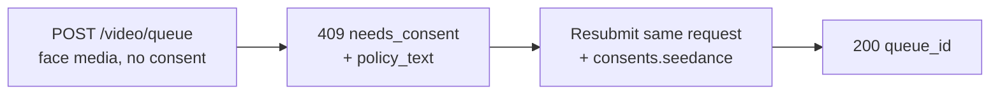

I modelli Seedance 2.0 image- e reference-to-video possono pilotare un video a partire da un **volto umano** che fornisci. Quando l'API Venice rileva un volto nel media che hai inviato, richiede un'**attestazione di consenso** una tantum prima di elaborarlo. Si tratta di un requisito del provider per gli input con volti e protegge da usi non consensuali della somiglianza.

Questa guida copre esattamente cosa invii, cosa ricevi e come vengono gestite le richieste successive.

## Quando si applica il consenso

Il consenso viene richiesto solo quando **entrambe** le condizioni sono vere:

1. Il modello è una variante Seedance abilitata per i volti:
   - `seedance-2-0-image-to-video`, `seedance-2-0-reference-to-video`
   - `seedance-2-0-fast-image-to-video`, `seedance-2-0-fast-reference-to-video`
2. Il media inviato contiene effettivamente un volto umano rilevabile, in uno qualsiasi di questi campi: `image_url`, `end_image_url`, `reference_image_urls`, `reference_video_urls`.

Se **non c'è alcun volto** in nessuno di questi campi, la richiesta procede normalmente senza step di consenso. Il text-to-video non entra mai in questo flusso.

<Note>
Il consenso non sblocca contenuti vietati. Un **minore rilevato combinato con prompt sessualmente suggestivi/NSFW**, o la **somiglianza di una figura pubblica** riconoscibile, viene rifiutato come violazione della content policy (`422`) e **non può** essere reso accettabile attestando il consenso.
</Note>

## Il flusso a due chiamate



### Chiamata 1 — invia senza consenso

Invia la tua richiesta di generazione come al solito — nessun campo di consenso:

```bash
curl -X POST https://api.venice.ai/api/v1/video/queue \
  -H "Authorization: Bearer $VENICE_API_KEY" \
  -H "Content-Type: application/json" \
  -d '{
    "model": "seedance-2-0-reference-to-video",
    "prompt": "Refer to <Subject 1> in <Image 1> to generate a 5-second clip of the same person walking through a sunlit market.",
    "reference_image_urls": ["https://example.com/person.jpg"],
    "duration": "5s",
    "aspect_ratio": "9:16",
    "resolution": "1080p"
  }'
```

Se viene rilevato un volto e non hai ancora attestato, ricevi un **`409`** non addebitato:

```json
{
  "error": {
    "code": "needs_consent",
    "message": "Seedance consent is required for this request."
  },
  "consent_flow": "seedance",
  "face_media_roles": ["reference_image"],
  "consent": {
    "consent_version": "v2.0",
    "policy_text": "The likeness in any media you upload is your own, or you have explicit, legal consent from any depicted individual(s). Note: an image may contain more than one face — your attestation covers all of them.\nYou own or have permission to use all media you uploaded for content generation.\nYou agree to the Venice.ai Terms of Service and Privacy Policy. Violations can lead to account suspension and legal liability.\nNo content is stored by Venice."
  },
  "docs_url": "https://docs.venice.ai/guides/media/seedance-face-consent"
}
```

| Campo | Significato |
|---|---|
| `face_media_roles` | Quali dei tuoi input contengono un volto: `image`, `end_image`, `reference_image`, `reference_video` |
| `consent.policy_text` | Il testo esatto dell'attestazione a cui devi acconsentire. Presentalo a chi è responsabile della richiesta. |
| `consent.consent_version` | La versione corrente della policy (impostata dal server; può cambiare nel tempo). Informativa — **non** la rimandi indietro. |

Nessun credito o pagamento x402 viene addebitato in caso di `409`.

### Chiamata 2 — reinvia con il consenso

Reinvia lo **stesso body della richiesta**, aggiungendo un oggetto `consents.seedance` con tre conferme, tutte `true`:

```bash
curl -X POST https://api.venice.ai/api/v1/video/queue \
  -H "Authorization: Bearer $VENICE_API_KEY" \
  -H "Content-Type: application/json" \
  -d '{
    "model": "seedance-2-0-reference-to-video",
    "prompt": "Refer to <Subject 1> in <Image 1> to generate a 5-second clip of the same person walking through a sunlit market.",
    "reference_image_urls": ["https://example.com/person.jpg"],
    "duration": "5s",
    "aspect_ratio": "9:16",
    "resolution": "1080p",
    "consents": {
      "seedance": {
        "confirmed_terms_and_privacy": true,
        "confirmed_legal_right": true,
        "confirmed_screening_acknowledged": true
      }
    }
  }'
```

Un invio andato a buon fine restituisce la normale risposta della coda:

```json
{ "model": "seedance-2-0-reference-to-video", "queue_id": "..." }
```

Quindi esegui il polling di `POST /api/v1/video/retrieve` con il `queue_id` come al solito (consulta [Generazione video](/guides/media/video-generation)).

## L'oggetto di consenso

```json
{
  "confirmed_terms_and_privacy": true,
  "confirmed_legal_right": true,
  "confirmed_screening_acknowledged": true
}
```

| Campo | Confermi che… |
|---|---|
| `confirmed_terms_and_privacy` | accetti il `policy_text` restituito nel `409`, inclusi i Termini di Servizio e la Privacy Policy di Venice |
| `confirmed_legal_right` | la somiglianza è tua o hai un consenso esplicito e legale da ogni individuo raffigurato |
| `confirmed_screening_acknowledged` | riconosci che il media inviato può essere automaticamente analizzato prima dell'elaborazione |

<Warning>
Tutti e tre i campi devono essere il booleano `true`. Qualsiasi campo mancante, un `false` o un campo **extra** — incluso un `consent_version` — viene rifiutato con un `400`. La versione della policy è sempre impostata dal server; i client non inviano né scelgono mai una versione.
</Warning>

## Richieste successive (dedupe)

Se invii **esattamente gli stessi byte del media** per cui hai già attestato, l'API lo riconosce e procede **senza** chiedere di nuovo il consenso — puoi omettere `consents.seedance` nei successivi invii identici. Questa corrispondenza si basa sui byte esatti dell'immagine: ricodifica, ridimensionamento o ritaglio producono byte diversi e attiveranno di nuovo la richiesta di consenso.

Una corrispondenza parziale (un input già attestato in precedenza più un nuovo input con volto) richiede comunque un nuovo `consents.seedance` sul nuovo invio.

## Revoca

Per revocare il consenso e cancellare gli asset di volto memorizzati, accedi alla web app Venice (**Settings**). La revoca non è disponibile tramite API pubblica. Dopo la revoca, la richiesta successiva che usa quel media chiederà nuovamente il consenso.

## Pagamento

La decisione sul consenso avviene sempre **prima** di qualsiasi addebito, per entrambi i metodi di pagamento:

- **API key:** un `409`/`422` viene restituito prima dell'addebito dei crediti; nulla viene fatturato per una richiesta bloccata.
- **x402:** l'addebito di consumo viene eseguito solo dopo una generazione riuscita, quindi un `409`/`422` non liquida nulla. Reinvia con il consenso (e una nuova autorizzazione x402) per procedere.

## Riferimento errori

| Stato | Body `error` | Causa |
|---|---|---|
| `409` | `needs_consent` | Volto rilevato, nessun `consents.seedance` valido, nessuna corrispondenza esatta del media. Reinvia con il consenso. |
| `400` | errore di validazione | `consents.seedance` malformato — una conferma mancante/`false` o un campo extra come `consent_version`. |
| `422` | `CONTENT_POLICY_VIOLATION` | Rilevato minore con contenuto suggestivo/NSFW o somiglianza di figura pubblica. Il consenso non sovrascrive questo. |
| `422` | `IMAGE_ASPECT_RATIO_OUT_OF_BOUNDS` | Un'**immagine con volto rilevato** è al di fuori del rapporto larghezza/altezza consentito `(0.4, 2.5)`. Controllato in modo sincrono durante il provisioning dell'asset di volto (prima dell'addebito); si applica solo una volta rilevato un volto in quell'immagine. |

## Riferimenti

- Endpoint della coda video: [`POST /api/v1/video/queue`](/api-reference/endpoint/video/queue)
- [Guida Seedance 2.0](/guides/media/seedance-2-0) — varianti, workflow, sintassi dei prompt, limiti
- [Generazione video](/guides/media/video-generation) — panoramica di coda / polling
