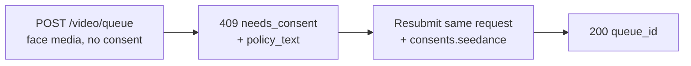

I modelli image- e reference-to-video di Seedance 2.0 possono guidare un video a partire da un **volto umano** che fornisci. Quando l'API Venice rileva un volto nei media inviati, richiede un'**attestazione di consenso** una tantum prima che i media vengano elaborati. Questo è un requisito del provider per gli input contenenti volti e protegge dall'uso non consensuale di likeness.

Questa guida spiega esattamente cosa inviare, cosa ricevi in risposta e come vengono gestite le richieste successive.

## Quando si applica il consenso

Il consenso viene richiesto solo quando **entrambe** le condizioni sono vere:

1. Il modello è una variante Seedance abilitata per i volti:
   - `seedance-2-0-image-to-video`, `seedance-2-0-reference-to-video`
   - `seedance-2-0-fast-image-to-video`, `seedance-2-0-fast-reference-to-video`
2. I media inviati contengono effettivamente un volto umano rilevabile, in uno di questi campi: `image_url`, `end_image_url`, `reference_image_urls`, `reference_video_urls`.

Se **non c'è nessun volto** in nessuno di questi campi, la richiesta procede normalmente senza passaggio di consenso. Il text-to-video non entra mai in questo flusso.

<Note>
Il consenso non sblocca contenuti soggetti a restrizioni. Un **minore rilevato in combinazione con prompt sessualmente suggestivi/NSFW**, o una **likeness di personaggio pubblico** riconoscibile, viene rifiutato come violazione della content-policy (`422`) e **non può** essere reso accettabile attestando il consenso.
</Note>

## Il flusso a due chiamate


```mermaid
flowchart LR
  A[POST /video/queue<br/>face media, no consent] --> B[409 needs_consent<br/>+ policy_text]
  B --> C[Resubmit same request<br/>+ consents.seedance]
  C --> D[200 queue_id]
```

### Chiamata 1: invio senza consenso

Invia la tua richiesta di generazione come al solito, senza campo di consenso:

```bash
curl -X POST https://api.venice.ai/api/v1/video/queue \
  -H "Authorization: Bearer $VENICE_API_KEY" \
  -H "Content-Type: application/json" \
  -d '{
    "model": "seedance-2-0-reference-to-video",
    "prompt": "Refer to <Subject 1> in <Image 1> to generate a 5-second clip of the same person walking through a sunlit market.",
    "reference_image_urls": ["https://example.com/person.jpg"],
    "duration": "5s",
    "aspect_ratio": "9:16",
    "resolution": "1080p"
  }'
```

Se viene rilevato un volto e non hai ancora attestato, ricevi un **`409`** che non genera addebito:

```json
{
  "error": {
    "code": "needs_consent",
    "message": "Seedance consent is required for this request."
  },
  "consent_flow": "seedance",
  "face_media_roles": ["reference_image"],
  "consent": {
    "consent_version": "v2.0",
    "policy_text": "The likeness in any media you upload is your own, or you have explicit, legal consent from any depicted individual(s). Note: an image may contain more than one face — your attestation covers all of them.\nYou own or have permission to use all media you uploaded for content generation.\nYou agree to the Venice.ai Terms of Service and Privacy Policy. Violations can lead to account suspension and legal liability.\nNo content is stored by Venice."
  },
  "docs_url": "https://docs.venice.ai/guides/media/seedance-face-consent"
}
```

| Campo | Significato |
|---|---|
| `face_media_roles` | Quali dei tuoi input contengono un volto: `image`, `end_image`, `reference_image`, `reference_video` |
| `consent.policy_text` | Il testo esatto dell'attestazione che devi accettare. Presentalo a chiunque sia responsabile della richiesta. |
| `consent.consent_version` | La versione corrente della policy (impostata dal server; può cambiare nel tempo). Informativa: **non** la rispedisci indietro. |

Nessun credito né pagamento x402 viene addebitato su un `409`.

### Chiamata 2: reinvio con consenso

Reinvia lo **stesso corpo di richiesta**, aggiungendo un oggetto `consents.seedance` con tre conferme, tutte a `true`:

```bash
curl -X POST https://api.venice.ai/api/v1/video/queue \
  -H "Authorization: Bearer $VENICE_API_KEY" \
  -H "Content-Type: application/json" \
  -d '{
    "model": "seedance-2-0-reference-to-video",
    "prompt": "Refer to <Subject 1> in <Image 1> to generate a 5-second clip of the same person walking through a sunlit market.",
    "reference_image_urls": ["https://example.com/person.jpg"],
    "duration": "5s",
    "aspect_ratio": "9:16",
    "resolution": "1080p",
    "consents": {
      "seedance": {
        "confirmed_terms_and_privacy": true,
        "confirmed_legal_right": true,
        "confirmed_screening_acknowledged": true
      }
    }
  }'
```

Un invio andato a buon fine restituisce la normale risposta di coda:

```json
{ "model": "seedance-2-0-reference-to-video", "queue_id": "..." }
```

Poi effettua polling su `POST /api/v1/video/retrieve` con il `queue_id` come al solito (vedi [Video Generation](/guides/media/video-generation)).

## L'oggetto di consenso

```json
{
  "confirmed_terms_and_privacy": true,
  "confirmed_legal_right": true,
  "confirmed_screening_acknowledged": true
}
```

| Campo | Confermi che… |
|---|---|
| `confirmed_terms_and_privacy` | accetti il `policy_text` restituito nel `409`, inclusi i Termini di Servizio e la Privacy Policy di Venice |
| `confirmed_legal_right` | la likeness è la tua o disponi del consenso esplicito e legale di ogni individuo raffigurato |
| `confirmed_screening_acknowledged` | riconosci che i media inviati possono essere sottoposti a screening automatico prima dell'elaborazione |

<Warning>
Tutti e tre i campi devono essere il booleano `true`. Qualsiasi campo mancante, un `false`, o qualsiasi campo **extra**, incluso un `consent_version`, viene rifiutato con un `400`. La versione della policy è sempre impostata dal server; i client non inviano né scelgono mai una versione.
</Warning>

## Richieste successive (dedupe)

Se invii **esattamente gli stessi byte di media** per cui hai già attestato il consenso, l'API lo riconosce e procede **senza** richiedere di nuovo il consenso: puoi omettere `consents.seedance` sugli invii identici successivi. Il match avviene per byte esatti dell'immagine: ricodifiche, ridimensionamenti o crop producono byte differenti e faranno di nuovo scattare la richiesta di consenso.

Un match parziale (un input precedentemente attestato più un nuovo input contenente un volto) richiede comunque un nuovo `consents.seedance` sul nuovo invio.

## Revoca

Per revocare il consenso e cancellare i face-asset memorizzati, accedi alla web app di Venice (**Settings**). La revoca non è disponibile tramite l'API pubblica. Dopo la revoca, la successiva richiesta che usa quei media chiederà di nuovo il consenso.

## Pagamento

La decisione sul consenso avviene sempre **prima** di qualsiasi addebito, per entrambi i metodi di pagamento:

- **Chiave API:** un `409`/`422` viene restituito prima dell'addebito dei crediti; nulla viene fatturato per una richiesta bloccata.
- **x402:** l'addebito di consumo viene eseguito solo dopo una generazione riuscita, quindi un `409`/`422` non regola nulla. Reinvia con il consenso (e una nuova autorizzazione x402) per procedere.

## Riferimento degli errori

| Stato | `error` nel body | Causa |
|---|---|---|
| `409` | `needs_consent` | Volto rilevato, nessun `consents.seedance` valido, nessun match esatto di media. Reinvia con il consenso. |
| `400` | validation error | `consents.seedance` malformato: una conferma mancante/`false` o un campo extra come `consent_version`. |
| `422` | `CONTENT_POLICY_VIOLATION` | Minore rilevato con contenuti suggestivi/NSFW, o likeness di un personaggio pubblico. Il consenso non lo scavalca. |
| `422` | `IMAGE_ASPECT_RATIO_OUT_OF_BOUNDS` | Un'**immagine con volto rilevato** ha un rapporto larghezza/altezza fuori dall'intervallo consentito `(0.4, 2.5)`. Verificato in modo sincrono durante il provisioning del face-asset (prima dell'addebito); si applica solo quando in quell'immagine viene rilevato un volto. |

## Riferimenti

- Endpoint della coda video: [`POST /api/v1/video/queue`](/api-reference/endpoint/video/queue)
- [Guida Seedance 2.0](/guides/media/seedance-2-0): varianti, flussi di lavoro, sintassi del prompt, limiti
- [Video Generation](/guides/media/video-generation): panoramica di coda / polling
