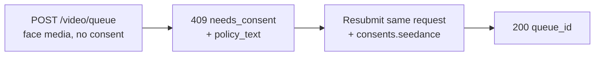

Seedance 2.0 image-to-video 및 reference-to-video 모델은 사용자가 제공하는 **사람 얼굴**로 비디오를 구동할 수 있습니다. Venice API가 제출된 미디어에서 얼굴을 감지하면 미디어가 처리되기 전에 일회성 **동의 증명**을 요구합니다. 이는 얼굴이 포함된 input에 대한 공급자 요구 사항이며, 비동의 얼굴 사용으로부터 보호합니다.

이 가이드는 정확히 무엇을 보내고, 무엇을 받으며, 재요청은 어떻게 처리되는지 다룹니다.

## 동의가 적용되는 경우

동의는 **둘 다** 참일 때만 요구됩니다:

1. 모델이 얼굴 사용 가능 Seedance 변형:
   - `seedance-2-0-image-to-video`, `seedance-2-0-reference-to-video`
   - `seedance-2-0-fast-image-to-video`, `seedance-2-0-fast-reference-to-video`
2. 제출된 미디어가 다음 필드 중 어디에든 감지 가능한 사람 얼굴을 실제로 포함: `image_url`, `end_image_url`, `reference_image_urls`, `reference_video_urls`.

그 필드 중 어디에도 **얼굴이 없다면** 요청은 동의 단계 없이 정상적으로 진행됩니다. Text-to-video는 이 흐름에 절대 들어가지 않습니다.

<Note>
동의는 제한된 콘텐츠를 해제하지 않습니다. **미성년자가 성적으로 시사하는 prompt/NSFW와 결합**되거나 **알아볼 수 있는 공인 얼굴**이 감지된 경우, 콘텐츠 정책 위반(`422`)으로 거부되며 동의 증명으로 **허용 가능**하게 만들 수 없습니다.
</Note>

## 두 번 호출 흐름



### 호출 1 — 동의 없이 제출

평소처럼 생성 요청을 제출합니다 — 동의 필드 없음:

```bash
curl -X POST https://api.venice.ai/api/v1/video/queue \
  -H "Authorization: Bearer $VENICE_API_KEY" \
  -H "Content-Type: application/json" \
  -d '{
    "model": "seedance-2-0-reference-to-video",
    "prompt": "Refer to <Subject 1> in <Image 1> to generate a 5-second clip of the same person walking through a sunlit market.",
    "reference_image_urls": ["https://example.com/person.jpg"],
    "duration": "5s",
    "aspect_ratio": "9:16",
    "resolution": "1080p"
  }'
```

얼굴이 감지되고 아직 증명하지 않았다면 과금 없는 **`409`**를 받습니다:

```json
{
  "error": {
    "code": "needs_consent",
    "message": "Seedance consent is required for this request."
  },
  "consent_flow": "seedance",
  "face_media_roles": ["reference_image"],
  "consent": {
    "consent_version": "v2.0",
    "policy_text": "The likeness in any media you upload is your own, or you have explicit, legal consent from any depicted individual(s). Note: an image may contain more than one face — your attestation covers all of them.\nYou own or have permission to use all media you uploaded for content generation.\nYou agree to the Venice.ai Terms of Service and Privacy Policy. Violations can lead to account suspension and legal liability.\nNo content is stored by Venice."
  },
  "docs_url": "https://docs.venice.ai/guides/media/seedance-face-consent"
}
```

| Field | Meaning |
|---|---|
| `face_media_roles` | input 중 얼굴이 포함된 것: `image`, `end_image`, `reference_image`, `reference_video` |
| `consent.policy_text` | 동의해야 하는 정확한 증명 텍스트. 요청 책임자에게 제시하세요. |
| `consent.consent_version` | 현재 정책 버전(서버 설정, 시간에 따라 변경 가능). 정보용 — 다시 보내지 **않습니다**. |

`409`에서는 크레딧이나 x402 결제가 부과되지 않습니다.

### 호출 2 — 동의와 함께 재제출

**같은 요청 본문**을 다시 보내되, 세 개의 확인이 모두 `true`인 `consents.seedance` 객체를 추가하세요:

```bash
curl -X POST https://api.venice.ai/api/v1/video/queue \
  -H "Authorization: Bearer $VENICE_API_KEY" \
  -H "Content-Type: application/json" \
  -d '{
    "model": "seedance-2-0-reference-to-video",
    "prompt": "Refer to <Subject 1> in <Image 1> to generate a 5-second clip of the same person walking through a sunlit market.",
    "reference_image_urls": ["https://example.com/person.jpg"],
    "duration": "5s",
    "aspect_ratio": "9:16",
    "resolution": "1080p",
    "consents": {
      "seedance": {
        "confirmed_terms_and_privacy": true,
        "confirmed_legal_right": true,
        "confirmed_screening_acknowledged": true
      }
    }
  }'
```

성공한 제출은 일반 큐 응답을 반환합니다:

```json
{ "model": "seedance-2-0-reference-to-video", "queue_id": "..." }
```

그런 다음 평소처럼 `queue_id`로 `POST /api/v1/video/retrieve`를 폴링하세요([Video Generation](/guides/media/video-generation) 참고).

## 동의 객체

```json
{
  "confirmed_terms_and_privacy": true,
  "confirmed_legal_right": true,
  "confirmed_screening_acknowledged": true
}
```

| Field | 확인하는 내용 |
|---|---|
| `confirmed_terms_and_privacy` | `409`에서 반환된 `policy_text`(Venice 이용약관과 개인정보 처리방침 포함)에 동의 |
| `confirmed_legal_right` | 얼굴은 본인의 것이거나, 묘사된 모든 개인으로부터 명시적·법적 동의를 받음 |
| `confirmed_screening_acknowledged` | 제출된 미디어가 처리 전에 자동으로 스크리닝될 수 있음을 인지 |

<Warning>
세 필드 모두 boolean `true`여야 합니다. 누락된 필드, `false`, 또는 `consent_version`을 포함한 **추가** 필드는 `400`으로 거부됩니다. 정책 버전은 항상 서버가 설정하며 클라이언트는 절대 버전을 보내거나 선택하지 않습니다.
</Warning>

## 재요청(dedupe)

이미 증명한 **정확히 동일한 미디어 바이트**를 제출하면 API가 이를 인식하고 동의를 다시 요구하지 **않고** 진행합니다 — 이후 동일한 제출에서는 `consents.seedance`를 생략할 수 있습니다. 이 매칭은 정확한 이미지 바이트 기준입니다: 재인코딩, 리사이즈, 크롭은 다른 바이트를 생성하므로 동의를 다시 요구합니다.

부분 일치(이전에 증명한 input 하나 + 새 얼굴 input 하나)는 새 제출에서 여전히 새 `consents.seedance`를 요구합니다.

## 철회

동의를 철회하고 저장된 얼굴 자산을 지우려면 Venice 웹 앱(**Settings**)에 로그인하세요. 철회는 공개 API로는 제공되지 않습니다. 철회 후 해당 미디어를 사용한 다음 요청은 다시 동의를 요구합니다.

## 결제

동의 결정은 결제 방식과 관계없이 항상 어떤 과금보다 **먼저** 일어납니다:

- **API 키:** `409`/`422`는 크레딧 과금 전에 반환되며, 차단된 요청에는 어떤 금액도 청구되지 않습니다.
- **x402:** 소비 과금은 성공한 생성 후에만 실행되므로, `409`/`422`는 아무것도 결제하지 않습니다. 동의(와 새 x402 권한 부여)와 함께 재제출해 진행하세요.

## 에러 레퍼런스

| Status | Body `error` | Cause |
|---|---|---|
| `409` | `needs_consent` | 얼굴 감지, 유효한 `consents.seedance` 없음, 정확한 미디어 매칭 없음. 동의와 함께 재제출. |
| `400` | 검증 에러 | 잘못된 `consents.seedance` — 누락/`false` 확인 또는 `consent_version` 같은 추가 필드. |
| `422` | `CONTENT_POLICY_VIOLATION` | 시사적/NSFW 콘텐츠가 있는 미성년자 감지 또는 공인 얼굴. 동의가 이를 override하지 않음. |
| `422` | `IMAGE_ASPECT_RATIO_OUT_OF_BOUNDS` | **얼굴이 감지된 이미지**가 허용 `(0.4, 2.5)` 폭/높이 비율을 벗어남. 얼굴 자산 프로비저닝 중(과금 전) 동기적으로 검사. 해당 이미지에서 얼굴이 감지된 경우에만 적용. |

## 참고 자료

- 비디오 큐 endpoint: [`POST /api/v1/video/queue`](/api-reference/endpoint/video/queue)
- [Seedance 2.0 가이드](/guides/media/seedance-2-0) — 변형, 워크플로, prompt 문법, 한도
- [Video Generation](/guides/media/video-generation) — 큐 / 폴링 개요
