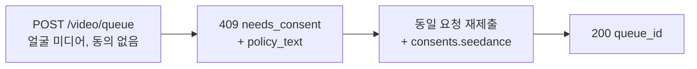

Seedance 2.0의 image-to-video 및 reference-to-video 모델은 사용자가 제공한 **사람 얼굴**을 기반으로 비디오를 생성할 수 있습니다. Venice API가 제출된 미디어에서 얼굴을 감지하면 처리 전에 일회성 **동의 확인**을 요구합니다. 이는 얼굴이 포함된 입력에 대한 공급자 요구 사항이며, 비동의 초상 이용을 방지합니다.

이 가이드에서는 정확히 무엇을 보내고, 무엇을 돌려받으며, 재요청이 어떻게 처리되는지 다룹니다.

## 동의가 적용되는 경우

동의는 **다음 두 조건이 모두** 참일 때만 요구됩니다:

1. 모델이 얼굴 사용이 가능한 Seedance 변형인 경우:
   - `seedance-2-0-image-to-video`, `seedance-2-0-reference-to-video`
   - `seedance-2-0-fast-image-to-video`, `seedance-2-0-fast-reference-to-video`
2. 제출된 미디어에 실제로 감지 가능한 사람 얼굴이 포함된 경우. 대상 필드: `image_url`, `end_image_url`, `reference_image_urls`, `reference_video_urls`.

이 필드들 어디에도 **얼굴이 없다면** 동의 단계 없이 요청이 정상 진행됩니다. Text-to-video는 이 흐름에 진입하지 않습니다.

<Note>
동의는 제한된 콘텐츠를 허용하지 않습니다. **미성년자가 성적으로 암시적인 prompt/NSFW와 결합된 경우**나 식별 가능한 **공인 초상**은 콘텐츠 정책 위반(`422`)으로 거부되며, 동의를 표명하더라도 **허용되지 않습니다**.
</Note>

## 두 단계 호출 흐름


```mermaid
flowchart LR
  A[POST /video/queue<br/>얼굴 미디어, 동의 없음] --> B[409 needs_consent<br/>+ policy_text]
  B --> C[동일 요청 재제출<br/>+ consents.seedance]
  C --> D[200 queue_id]
```

### 호출 1 — 동의 없이 제출

평소처럼 생성 요청을 제출합니다. 동의 필드 없이 진행합니다:

```bash
curl -X POST https://api.venice.ai/api/v1/video/queue \
  -H "Authorization: Bearer $VENICE_API_KEY" \
  -H "Content-Type: application/json" \
  -d '{
    "model": "seedance-2-0-reference-to-video",
    "prompt": "Refer to <Subject 1> in <Image 1> to generate a 5-second clip of the same person walking through a sunlit market.",
    "reference_image_urls": ["https://example.com/person.jpg"],
    "duration": "5s",
    "aspect_ratio": "9:16",
    "resolution": "1080p"
  }'
```

얼굴이 감지되었고 아직 확인을 하지 않았다면, 과금되지 않는 **`409`**를 받습니다:

```json
{
  "error": {
    "code": "needs_consent",
    "message": "Seedance consent is required for this request."
  },
  "consent_flow": "seedance",
  "face_media_roles": ["reference_image"],
  "consent": {
    "consent_version": "v2.0",
    "policy_text": "The likeness in any media you upload is your own, or you have explicit, legal consent from any depicted individual(s). Note: an image may contain more than one face — your attestation covers all of them.\nYou own or have permission to use all media you uploaded for content generation.\nYou agree to the Venice.ai Terms of Service and Privacy Policy. Violations can lead to account suspension and legal liability.\nNo content is stored by Venice."
  },
  "docs_url": "https://docs.venice.ai/guides/media/seedance-face-consent"
}
```

| 필드 | 의미 |
|---|---|
| `face_media_roles` | 얼굴이 포함된 입력의 종류: `image`, `end_image`, `reference_image`, `reference_video` |
| `consent.policy_text` | 동의해야 하는 정확한 확인 문구입니다. 요청을 담당하는 사람에게 제시하세요. |
| `consent.consent_version` | 현재 정책 버전(서버가 설정하며 시간에 따라 변경될 수 있음). 정보용이며 다시 **보내지 않습니다**. |

`409` 시 크레딧이나 x402 결제는 청구되지 않습니다.

### 호출 2 — 동의와 함께 재제출

**동일한 요청 본문**을 다시 보내되, 세 개의 확인이 모두 `true`인 `consents.seedance` 객체를 추가합니다:

```bash
curl -X POST https://api.venice.ai/api/v1/video/queue \
  -H "Authorization: Bearer $VENICE_API_KEY" \
  -H "Content-Type: application/json" \
  -d '{
    "model": "seedance-2-0-reference-to-video",
    "prompt": "Refer to <Subject 1> in <Image 1> to generate a 5-second clip of the same person walking through a sunlit market.",
    "reference_image_urls": ["https://example.com/person.jpg"],
    "duration": "5s",
    "aspect_ratio": "9:16",
    "resolution": "1080p",
    "consents": {
      "seedance": {
        "confirmed_terms_and_privacy": true,
        "confirmed_legal_right": true,
        "confirmed_screening_acknowledged": true
      }
    }
  }'
```

성공적으로 제출되면 일반적인 큐 응답이 반환됩니다:

```json
{ "model": "seedance-2-0-reference-to-video", "queue_id": "..." }
```

그런 다음 평소처럼 `queue_id`를 사용해 `POST /api/v1/video/retrieve`를 폴링합니다 ([Video Generation](/guides/media/video-generation) 참고).

## 동의 객체

```json
{
  "confirmed_terms_and_privacy": true,
  "confirmed_legal_right": true,
  "confirmed_screening_acknowledged": true
}
```

| 필드 | 확인 내용 |
|---|---|
| `confirmed_terms_and_privacy` | Venice 서비스 약관 및 개인정보처리방침을 포함해 `409`에서 반환된 `policy_text`에 동의함 |
| `confirmed_legal_right` | 초상이 본인의 것이거나, 등장하는 모든 개인으로부터 명시적이고 합법적인 동의를 받았음 |
| `confirmed_screening_acknowledged` | 제출된 미디어가 처리 전 자동으로 심사될 수 있음을 인지함 |

<Warning>
세 필드 모두 반드시 부울 `true`여야 합니다. 필드 누락, `false`, 또는 `consent_version`을 포함한 **추가** 필드가 있으면 `400`으로 거부됩니다. 정책 버전은 항상 서버가 설정하며, 클라이언트가 버전을 보내거나 선택하는 일은 없습니다.
</Warning>

## 재요청 (중복 처리)

이미 확인한 것과 **정확히 동일한 미디어 바이트**를 제출하면, API가 이를 인식하여 **다시 동의를 요구하지 않고** 진행합니다. 이후 동일한 제출에서는 `consents.seedance`를 생략해도 됩니다. 이 일치는 정확한 이미지 바이트를 기준으로 하므로, 재인코딩, 크기 조정, 잘라내기 등을 하면 바이트가 달라져 다시 동의를 요구하게 됩니다.

부분 일치(이전에 확인된 입력 하나와 새로운 얼굴 입력 하나)의 경우, 새로운 제출에 대해 새 `consents.seedance`가 여전히 필요합니다.

## 철회

동의를 철회하고 저장된 얼굴 자산을 삭제하려면 Venice 웹 앱(**설정**)에 로그인하세요. 철회는 공개 API에서 제공되지 않습니다. 철회 이후 해당 미디어를 사용하는 다음 요청은 다시 동의를 요구합니다.

## 결제

동의 결정은 두 결제 방식 모두에 대해 항상 과금 **이전에** 이루어집니다:

- **API 키:** 크레딧이 청구되기 전에 `409`/`422`가 반환됩니다. 차단된 요청에는 아무 것도 청구되지 않습니다.
- **x402:** 소비 요금은 성공적으로 생성된 이후에만 발생하므로, `409`/`422`는 정산 없이 종료됩니다. 진행하려면 동의(및 새로운 x402 인증)와 함께 다시 제출하세요.

## 오류 참조

| 상태 | 본문 `error` | 원인 |
|---|---|---|
| `409` | `needs_consent` | 얼굴이 감지되었으나 유효한 `consents.seedance`가 없고, 정확한 미디어 일치도 없음. 동의와 함께 재제출하세요. |
| `400` | 검증 오류 | 잘못된 형식의 `consents.seedance`. 확인 필드 누락/`false`이거나, `consent_version` 같은 추가 필드 존재. |
| `422` | `CONTENT_POLICY_VIOLATION` | 암시적/NSFW 콘텐츠와 결합된 미성년자 감지, 또는 공인 초상. 동의로 이를 무효화할 수 없습니다. |
| `422` | `IMAGE_ASPECT_RATIO_OUT_OF_BOUNDS` | **얼굴이 감지된 이미지**가 허용된 폭/높이 비율 `(0.4, 2.5)`를 벗어남. 얼굴 자산 프로비저닝 중 동기적으로(과금 전) 검사되며, 해당 이미지에서 얼굴이 감지된 경우에만 적용됩니다. |

## 참고 자료

- 비디오 큐 엔드포인트: [`POST /api/v1/video/queue`](/api-reference/endpoint/video/queue)
- [Seedance 2.0 가이드](/guides/media/seedance-2-0) — 변형, 워크플로우, prompt 구문, 제한
- [Video Generation](/guides/media/video-generation) — 큐/폴링 개요
