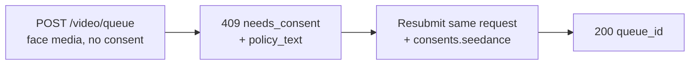

Seedance 2.0 image- and reference-to-video models can drive a video from a **human face** you supply. When the Venice API detects a face in your submitted media, it requires a one-time **consent attestation** before the media is processed. This is a provider requirement for face-bearing inputs and protects against non-consensual likeness use.

Este guia covers exactly what you send, what you get back, and how returning requests are handled.

## When consent applies

Consent is only requested when **both** are true:

1. The model is a face-eligible Seedance variant:
   - `seedance-2-0-image-to-video`, `seedance-2-0-reference-to-video`
   - `seedance-2-0-fast-image-to-video`, `seedance-2-0-fast-reference-to-video`
2. The submitted media actually contains a detectable human face, in any of these fields: `image_url`, `end_image_url`, `reference_image_urls`, `reference_video_urls`.

If there is **no face** in any of those fields, the request proceeds normally with no consent step. Text-to-video never enters this flow.

<Note>
Consent does not unlock restricted content. A detected **minor combined with sexually-suggestive prompts/NSFW**, or a recognizable **public-figure likeness**, is rejected as a content-policy violation (`422`) and **cannot** be made acceptable by attesting consent.
</Note>

## The two-call flow



### Call 1 — submit without consent

Submit your generation request as usual — no consent field:

```bash
curl -X POST https://api.venice.ai/api/v1/video/queue \
  -H "Authorization: Bearer $VENICE_API_KEY" \
  -H "Content-Type: application/json" \
  -d '{
    "model": "seedance-2-0-reference-to-video",
    "prompt": "Refer to <Subject 1> in <Image 1> to generate a 5-second clip of the same person walking through a sunlit market.",
    "reference_image_urls": ["https://example.com/person.jpg"],
    "duration": "5s",
    "aspect_ratio": "9:16",
    "resolution": "1080p"
  }'
```

If a face is detected and you have not yet attested, you get a non-charging **`409`**:

```json
{
  "error": {
    "code": "needs_consent",
    "message": "Seedance consent is required for this request."
  },
  "consent_flow": "seedance",
  "face_media_roles": ["reference_image"],
  "consent": {
    "consent_version": "v2.0",
    "policy_text": "The likeness in any media you upload is your own, or you have explicit, legal consent from any depicted individual(s). Note: an image may contain more than one face — your attestation covers all of them.\nYou own or have permission to use all media you uploaded for content generation.\nYou agree to the Venice.ai Terms of Service and Privacy Policy. Violations can lead to account suspension and legal liability.\nNo content is stored by Venice."
  },
  "docs_url": "https://docs.venice.ai/guides/media/seedance-face-consent"
}
```

| Field | Meaning |
|---|---|
| `face_media_roles` | Which of your inputs contain a face: `image`, `end_image`, `reference_image`, `reference_video` |
| `consent.policy_text` | The exact attestation text you must agree to. Present it to whoever is responsible for the request. |
| `consent.consent_version` | The current policy version (server-set; can change over time). Informational — you do **not** send it back. |

No credits or x402 payment are charged on a `409`.

### Call 2 — resubmit with consent

Resend the **same request body**, adding a `consents.seedance` object with three confirmations, all `true`:

```bash
curl -X POST https://api.venice.ai/api/v1/video/queue \
  -H "Authorization: Bearer $VENICE_API_KEY" \
  -H "Content-Type: application/json" \
  -d '{
    "model": "seedance-2-0-reference-to-video",
    "prompt": "Refer to <Subject 1> in <Image 1> to generate a 5-second clip of the same person walking through a sunlit market.",
    "reference_image_urls": ["https://example.com/person.jpg"],
    "duration": "5s",
    "aspect_ratio": "9:16",
    "resolution": "1080p",
    "consents": {
      "seedance": {
        "confirmed_terms_and_privacy": true,
        "confirmed_legal_right": true,
        "confirmed_screening_acknowledged": true
      }
    }
  }'
```

A successful submission returns the normal queue response:

```json
{ "model": "seedance-2-0-reference-to-video", "queue_id": "..." }
```

Then poll `POST /api/v1/video/retrieve` with the `queue_id` as usual (veja [Video Generation](/pt-BR/guides/media/video-generation)).

## The consent object

```json
{
  "confirmed_terms_and_privacy": true,
  "confirmed_legal_right": true,
  "confirmed_screening_acknowledged": true
}
```

| Field | You confirm that… |
|---|---|
| `confirmed_terms_and_privacy` | you accept the `policy_text` returned in the `409`, including the Venice Terms of Service and Privacy Policy |
| `confirmed_legal_right` | the likeness is your own or you have explicit, legal consent from every depicted individual |
| `confirmed_screening_acknowledged` | you acknowledge that submitted media may be automatically screened before processing |

<Warning>
All three fields must be the boolean `true`. Any missing field, a `false`, or any **extra** field — including a `consent_version` — is rejected with a `400`. The policy version is always set by the server; clients never send or pick a version.
</Warning>

## Returning requests (dedupe)

If you submit **the exact same media bytes** you have already attested to, the API recognizes it and proceeds **without** asking for consent again — you can omit `consents.seedance` on subsequent identical submissions. This match is by exact image bytes: re-encoding, resizing, or cropping produces different bytes and will prompt for consent again.

A partial match (one previously-attested input plus one new face input) still requires a fresh `consents.seedance` on the new submission.

## Revocation

To revoke consent and erase stored face assets, sign in to the Venice web app (**Settings**). Revocation is not available through the public API. After revoking, the next request using that media will prompt for consent again.

## Payment

The consent decision always happens **before** any charge, for both payment methods:

- **API key:** a `409`/`422` returns before the credit charge; nothing is billed for a blocked request.
- **x402:** the consumption charge runs only after a successful generation, so a `409`/`422` settles nothing. Re-submit with consent (and a fresh x402 authorization) to proceed.

## Error reference

| Status | Body `error` | Cause |
|---|---|---|
| `409` | `needs_consent` | Face detected, no valid `consents.seedance`, no exact-media match. Resubmit with consent. |
| `400` | validation error | Malformed `consents.seedance` — a missing/`false` confirmation or an extra field such as `consent_version`. |
| `422` | `CONTENT_POLICY_VIOLATION` | Detected minor with suggestive/NSFW content, or a public-figure likeness. Consent does not override this. |
| `422` | `IMAGE_ASPECT_RATIO_OUT_OF_BOUNDS` | A **detected-face image** is outside the allowed `(0.4, 2.5)` width/height ratio. Checked synchronously during face-asset provisioning (before charge); only applies once a face is detected in that image. |

## References

- Video queue endpoint: [`POST /api/v1/video/queue`](/pt-BR/api-reference/endpoint/video/queue)
- [Seedance 2.0 Guide](/pt-BR/guides/media/seedance-2-0) — variants, workflows, prompt syntax, limits
- [Video Generation](/pt-BR/guides/media/video-generation) — queue / polling overview
