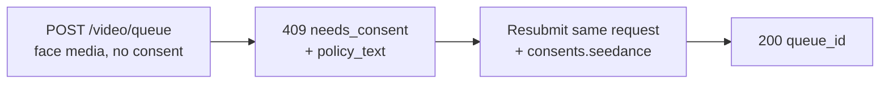

Os modelos image- e reference-to-video do Seedance 2.0 podem dirigir um vídeo a partir de um **rosto humano** que você forneça. Quando a API Venice detecta um rosto na mídia enviada, ela exige uma **atestação de consentimento** única antes de a mídia ser processada. Isso é um requisito do provedor para entradas com rostos e protege contra o uso de semelhança sem consentimento.

Este guia cobre exatamente o que você envia, o que recebe de volta e como requisições subsequentes são tratadas.

## Quando o consentimento se aplica

O consentimento é solicitado apenas quando **ambos** forem verdadeiros:

1. O modelo é uma variante Seedance habilitada para rosto:
   - `seedance-2-0-image-to-video`, `seedance-2-0-reference-to-video`
   - `seedance-2-0-fast-image-to-video`, `seedance-2-0-fast-reference-to-video`
2. A mídia enviada de fato contém um rosto humano detectável, em qualquer um destes campos: `image_url`, `end_image_url`, `reference_image_urls`, `reference_video_urls`.

Se **não houver rosto** em nenhum desses campos, a requisição prossegue normalmente sem etapa de consentimento. Text-to-video nunca entra neste fluxo.

<Note>
Consentimento não desbloqueia conteúdo restrito. Um **menor detectado combinado com prompts sugestivos/NSFW**, ou uma **semelhança de figura pública** reconhecível, é rejeitada como violação de política de conteúdo (`422`) e **não pode** ser tornada aceitável atestando consentimento.
</Note>

## O fluxo de duas chamadas



### Chamada 1 — envie sem consentimento

Envie sua requisição de geração como de costume — sem campo de consentimento:

```bash
curl -X POST https://api.venice.ai/api/v1/video/queue \
  -H "Authorization: Bearer $VENICE_API_KEY" \
  -H "Content-Type: application/json" \
  -d '{
    "model": "seedance-2-0-reference-to-video",
    "prompt": "Refer to <Subject 1> in <Image 1> to generate a 5-second clip of the same person walking through a sunlit market.",
    "reference_image_urls": ["https://example.com/person.jpg"],
    "duration": "5s",
    "aspect_ratio": "9:16",
    "resolution": "1080p"
  }'
```

Se um rosto for detectado e você ainda não tiver atestado, você recebe um **`409`** que não cobra:

```json
{
  "error": {
    "code": "needs_consent",
    "message": "Seedance consent is required for this request."
  },
  "consent_flow": "seedance",
  "face_media_roles": ["reference_image"],
  "consent": {
    "consent_version": "v2.0",
    "policy_text": "The likeness in any media you upload is your own, or you have explicit, legal consent from any depicted individual(s). Note: an image may contain more than one face — your attestation covers all of them.\nYou own or have permission to use all media you uploaded for content generation.\nYou agree to the Venice.ai Terms of Service and Privacy Policy. Violations can lead to account suspension and legal liability.\nNo content is stored by Venice."
  },
  "docs_url": "https://docs.venice.ai/guides/media/seedance-face-consent"
}
```

| Campo | Significado |
|---|---|
| `face_media_roles` | Quais das suas entradas contêm um rosto: `image`, `end_image`, `reference_image`, `reference_video` |
| `consent.policy_text` | O texto exato de atestação com o qual você deve concordar. Apresente-o a quem for responsável pela requisição. |
| `consent.consent_version` | A versão atual da política (definida pelo servidor; pode mudar com o tempo). Informativo — você **não** envia de volta. |

Nenhum crédito ou pagamento x402 é cobrado em um `409`.

### Chamada 2 — reenvie com consentimento

Reenvie o **mesmo corpo de requisição**, adicionando um objeto `consents.seedance` com três confirmações, todas `true`:

```bash
curl -X POST https://api.venice.ai/api/v1/video/queue \
  -H "Authorization: Bearer $VENICE_API_KEY" \
  -H "Content-Type: application/json" \
  -d '{
    "model": "seedance-2-0-reference-to-video",
    "prompt": "Refer to <Subject 1> in <Image 1> to generate a 5-second clip of the same person walking through a sunlit market.",
    "reference_image_urls": ["https://example.com/person.jpg"],
    "duration": "5s",
    "aspect_ratio": "9:16",
    "resolution": "1080p",
    "consents": {
      "seedance": {
        "confirmed_terms_and_privacy": true,
        "confirmed_legal_right": true,
        "confirmed_screening_acknowledged": true
      }
    }
  }'
```

Um envio bem-sucedido retorna a resposta normal de fila:

```json
{ "model": "seedance-2-0-reference-to-video", "queue_id": "..." }
```

Em seguida, faça polling em `POST /api/v1/video/retrieve` com o `queue_id` como de costume (veja [Geração de vídeo](/guides/media/video-generation)).

## O objeto de consentimento

```json
{
  "confirmed_terms_and_privacy": true,
  "confirmed_legal_right": true,
  "confirmed_screening_acknowledged": true
}
```

| Campo | Você confirma que… |
|---|---|
| `confirmed_terms_and_privacy` | aceita o `policy_text` retornado no `409`, incluindo os Termos de Serviço e a Política de Privacidade da Venice |
| `confirmed_legal_right` | a semelhança é sua ou você tem consentimento legal explícito de cada indivíduo retratado |
| `confirmed_screening_acknowledged` | reconhece que a mídia enviada pode ser triada automaticamente antes do processamento |

<Warning>
Todos os três campos devem ser o booleano `true`. Qualquer campo ausente, um `false`, ou qualquer campo **extra** — incluindo um `consent_version` — é rejeitado com um `400`. A versão da política é sempre definida pelo servidor; clientes nunca enviam ou escolhem uma versão.
</Warning>

## Requisições subsequentes (dedupe)

Se você enviar **exatamente os mesmos bytes de mídia** com os quais já atestou, a API reconhece isso e prossegue **sem** pedir consentimento novamente — você pode omitir `consents.seedance` em envios idênticos subsequentes. Essa correspondência é por bytes exatos da imagem: re-codificar, redimensionar ou cortar produz bytes diferentes e solicitará consentimento novamente.

Uma correspondência parcial (uma entrada previamente atestada mais uma nova entrada com rosto) ainda exige um `consents.seedance` novo no novo envio.

## Revogação

Para revogar o consentimento e apagar ativos faciais armazenados, faça login no aplicativo web da Venice (**Configurações**). A revogação não está disponível pela API pública. Após revogar, a próxima requisição usando essa mídia solicitará consentimento novamente.

## Pagamento

A decisão de consentimento sempre acontece **antes** de qualquer cobrança, para ambos os métodos de pagamento:

- **Chave de API:** um `409`/`422` retorna antes da cobrança em créditos; nada é faturado por uma requisição bloqueada.
- **x402:** a cobrança de consumo só acontece após uma geração bem-sucedida, então um `409`/`422` não liquida nada. Reenvie com consentimento (e uma nova autorização x402) para prosseguir.

## Referência de erros

| Status | `error` no corpo | Causa |
|---|---|---|
| `409` | `needs_consent` | Rosto detectado, nenhum `consents.seedance` válido, sem correspondência exata de mídia. Reenvie com consentimento. |
| `400` | erro de validação | `consents.seedance` malformado — uma confirmação ausente/`false` ou um campo extra como `consent_version`. |
| `422` | `CONTENT_POLICY_VIOLATION` | Menor detectado com conteúdo sugestivo/NSFW ou uma semelhança de figura pública. Consentimento não anula isso. |
| `422` | `IMAGE_ASPECT_RATIO_OUT_OF_BOUNDS` | Uma **imagem com rosto detectado** está fora da proporção permitida `(0.4, 2.5)` largura/altura. Verificado sincronicamente durante o provisionamento do ativo de rosto (antes da cobrança); só se aplica quando um rosto é detectado nessa imagem. |

## Referências

- Endpoint de fila de vídeo: [`POST /api/v1/video/queue`](/api-reference/endpoint/video/queue)
- [Guia do Seedance 2.0](/guides/media/seedance-2-0) — variantes, workflows, sintaxe do prompt, limites
- [Geração de vídeo](/guides/media/video-generation) — visão geral de fila / polling
