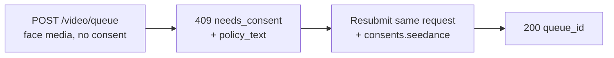

Os modelos image-to-video e reference-to-video do Seedance 2.0 podem conduzir um vídeo a partir de um **rosto humano** que você fornece. Quando a API Venice detecta um rosto na mídia enviada, ela requer uma **atestação de consentimento** única antes de a mídia ser processada. Esse é um requisito do provedor para entradas contendo rostos e protege contra o uso não consentido de likeness.

Este guia cobre exatamente o que você envia, o que recebe de volta e como requisições recorrentes são tratadas.

## Quando o consentimento se aplica

O consentimento só é solicitado quando **ambos** são verdadeiros:

1. O modelo é uma variante Seedance elegível para rostos:
   - `seedance-2-0-image-to-video`, `seedance-2-0-reference-to-video`
   - `seedance-2-0-fast-image-to-video`, `seedance-2-0-fast-reference-to-video`
2. A mídia enviada realmente contém um rosto humano detectável, em qualquer um destes campos: `image_url`, `end_image_url`, `reference_image_urls`, `reference_video_urls`.

Se **não houver rosto** em nenhum desses campos, a requisição segue normalmente sem passo de consentimento. Text-to-video nunca entra nesse fluxo.

<Note>
O consentimento não desbloqueia conteúdo restrito. Um **menor de idade detectado combinado com prompts sexualmente sugestivos/NSFW**, ou uma **likeness de figura pública** reconhecível, é rejeitado como violação de política de conteúdo (`422`) e **não pode** se tornar aceitável ao atestar o consentimento.
</Note>

## O fluxo em duas chamadas


```mermaid
flowchart LR
  A[POST /video/queue<br/>face media, no consent] --> B[409 needs_consent<br/>+ policy_text]
  B --> C[Resubmit same request<br/>+ consents.seedance]
  C --> D[200 queue_id]
```

### Chamada 1 — submeter sem consentimento

Envie sua requisição de geração normalmente, sem campo de consentimento:

```bash
curl -X POST https://api.venice.ai/api/v1/video/queue \
  -H "Authorization: Bearer $VENICE_API_KEY" \
  -H "Content-Type: application/json" \
  -d '{
    "model": "seedance-2-0-reference-to-video",
    "prompt": "Refer to <Subject 1> in <Image 1> to generate a 5-second clip of the same person walking through a sunlit market.",
    "reference_image_urls": ["https://example.com/person.jpg"],
    "duration": "5s",
    "aspect_ratio": "9:16",
    "resolution": "1080p"
  }'
```

Se um rosto for detectado e você ainda não tiver atestado, você recebe um **`409`** que não gera cobrança:

```json
{
  "error": {
    "code": "needs_consent",
    "message": "Seedance consent is required for this request."
  },
  "consent_flow": "seedance",
  "face_media_roles": ["reference_image"],
  "consent": {
    "consent_version": "v2.0",
    "policy_text": "The likeness in any media you upload is your own, or you have explicit, legal consent from any depicted individual(s). Note: an image may contain more than one face — your attestation covers all of them.\nYou own or have permission to use all media you uploaded for content generation.\nYou agree to the Venice.ai Terms of Service and Privacy Policy. Violations can lead to account suspension and legal liability.\nNo content is stored by Venice."
  },
  "docs_url": "https://docs.venice.ai/guides/media/seedance-face-consent"
}
```

| Campo | Significado |
|---|---|
| `face_media_roles` | Quais das suas entradas contêm um rosto: `image`, `end_image`, `reference_image`, `reference_video` |
| `consent.policy_text` | O texto exato de atestação com o qual você deve concordar. Apresente-o a quem for responsável pela requisição. |
| `consent.consent_version` | A versão atual da política (definida pelo servidor; pode mudar ao longo do tempo). Informativo: você **não** o envia de volta. |

Nenhum crédito ou pagamento x402 é cobrado em um `409`.

### Chamada 2 — reenviar com consentimento

Reenvie o **mesmo corpo de requisição**, adicionando um objeto `consents.seedance` com três confirmações, todas `true`:

```bash
curl -X POST https://api.venice.ai/api/v1/video/queue \
  -H "Authorization: Bearer $VENICE_API_KEY" \
  -H "Content-Type: application/json" \
  -d '{
    "model": "seedance-2-0-reference-to-video",
    "prompt": "Refer to <Subject 1> in <Image 1> to generate a 5-second clip of the same person walking through a sunlit market.",
    "reference_image_urls": ["https://example.com/person.jpg"],
    "duration": "5s",
    "aspect_ratio": "9:16",
    "resolution": "1080p",
    "consents": {
      "seedance": {
        "confirmed_terms_and_privacy": true,
        "confirmed_legal_right": true,
        "confirmed_screening_acknowledged": true
      }
    }
  }'
```

Uma submissão bem-sucedida retorna a resposta normal da fila:

```json
{ "model": "seedance-2-0-reference-to-video", "queue_id": "..." }
```

Depois faça polling em `POST /api/v1/video/retrieve` com o `queue_id` como de costume (veja [Geração de vídeo](/guides/media/video-generation)).

## O objeto de consentimento

```json
{
  "confirmed_terms_and_privacy": true,
  "confirmed_legal_right": true,
  "confirmed_screening_acknowledged": true
}
```

| Campo | Você confirma que… |
|---|---|
| `confirmed_terms_and_privacy` | você aceita o `policy_text` retornado no `409`, incluindo os Termos de Serviço e a Política de Privacidade da Venice |
| `confirmed_legal_right` | a likeness é sua ou você tem consentimento legal explícito de cada indivíduo retratado |
| `confirmed_screening_acknowledged` | você reconhece que a mídia enviada pode ser triada automaticamente antes do processamento |

<Warning>
Todos os três campos devem ser o booleano `true`. Qualquer campo ausente, um `false` ou qualquer campo **extra** (incluindo um `consent_version`) é rejeitado com um `400`. A versão da política é sempre definida pelo servidor; clientes nunca enviam ou escolhem uma versão.
</Warning>

## Requisições recorrentes (dedupe)

Se você enviar **exatamente os mesmos bytes de mídia** que já atestou, a API reconhece isso e prossegue **sem** pedir consentimento novamente. Você pode omitir `consents.seedance` em submissões idênticas subsequentes. Essa correspondência é feita por bytes exatos da imagem: recodificar, redimensionar ou recortar produz bytes diferentes e vai pedir consentimento novamente.

Uma correspondência parcial (uma entrada previamente atestada mais uma nova entrada com rosto) ainda requer um `consents.seedance` novo na nova submissão.

## Revogação

Para revogar o consentimento e apagar face assets armazenados, faça login no app web da Venice (**Settings**). A revogação não está disponível pela API pública. Após revogar, a próxima requisição usando aquela mídia vai pedir consentimento novamente.

## Pagamento

A decisão de consentimento acontece sempre **antes** de qualquer cobrança, para ambos os métodos de pagamento:

- **Chave de API:** um `409`/`422` retorna antes da cobrança do crédito; nada é cobrado por uma requisição bloqueada.
- **x402:** a cobrança de consumo só roda após uma geração bem-sucedida, então um `409`/`422` não liquida nada. Reenvie com consentimento (e uma nova autorização x402) para prosseguir.

## Referência de erros

| Status | Corpo `error` | Causa |
|---|---|---|
| `409` | `needs_consent` | Rosto detectado, sem `consents.seedance` válido, sem correspondência exata de mídia. Reenvie com consentimento. |
| `400` | erro de validação | `consents.seedance` malformado: uma confirmação ausente/`false` ou um campo extra como `consent_version`. |
| `422` | `CONTENT_POLICY_VIOLATION` | Menor de idade detectado com conteúdo sugestivo/NSFW, ou likeness de figura pública. O consentimento não sobrepõe isso. |
| `422` | `IMAGE_ASPECT_RATIO_OUT_OF_BOUNDS` | Uma **imagem com rosto detectado** está fora da proporção largura/altura permitida `(0.4, 2.5)`. Verificado sincronamente durante o provisionamento do face-asset (antes da cobrança); só se aplica quando um rosto é detectado naquela imagem. |

## Referências

- Endpoint da fila de vídeo: [`POST /api/v1/video/queue`](/api-reference/endpoint/video/queue)
- [Guia do Seedance 2.0](/guides/media/seedance-2-0) — variantes, workflows, sintaxe de prompt, limites
- [Geração de vídeo](/guides/media/video-generation) — visão geral de fila / polling
