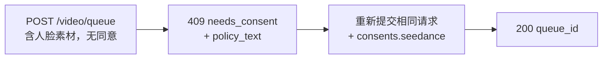

Seedance 2.0 的 image-to-video 和 reference-to-video 模型可以根据你提供的**人脸**驱动视频生成。当 Venice API 在你提交的素材中检测到人脸时，会在处理素材前要求一次性的**同意声明**。这是面部素材输入的服务方要求，用于防止非自愿地使用他人肖像。

本指南详细说明你需要发送什么、会收到什么响应，以及重复提交的处理方式。

## 何时需要同意

仅在**同时满足**以下两个条件时才会要求同意：

1. 模型是支持人脸的 Seedance 变体：
   - `seedance-2-0-image-to-video`、`seedance-2-0-reference-to-video`
   - `seedance-2-0-fast-image-to-video`、`seedance-2-0-fast-reference-to-video`
2. 提交的素材在以下任一字段中确实包含可检测到的人脸：`image_url`、`end_image_url`、`reference_image_urls`、`reference_video_urls`。

如果上述字段中**没有人脸**，请求正常进行，无需同意步骤。text-to-video 永远不会进入此流程。

<Note>
同意并不能解锁受限内容。检测到的**未成年人结合性暗示 prompt/NSFW**，或可识别的**公众人物肖像**，将作为内容策略违规被拒绝（`422`），并且**无法**通过声明同意而被接受。
</Note>

## 两步调用流程



### 第 1 次调用——不带同意提交

像往常一样提交生成请求——不带 consent 字段：

```bash
curl -X POST https://api.venice.ai/api/v1/video/queue \
  -H "Authorization: Bearer $VENICE_API_KEY" \
  -H "Content-Type: application/json" \
  -d '{
    "model": "seedance-2-0-reference-to-video",
    "prompt": "Refer to <Subject 1> in <Image 1> to generate a 5-second clip of the same person walking through a sunlit market.",
    "reference_image_urls": ["https://example.com/person.jpg"],
    "duration": "5s",
    "aspect_ratio": "9:16",
    "resolution": "1080p"
  }'
```

如果检测到人脸且你尚未声明同意，会得到一个不扣费的 **`409`**：

```json
{
  "error": {
    "code": "needs_consent",
    "message": "Seedance consent is required for this request."
  },
  "consent_flow": "seedance",
  "face_media_roles": ["reference_image"],
  "consent": {
    "consent_version": "v2.0",
    "policy_text": "The likeness in any media you upload is your own, or you have explicit, legal consent from any depicted individual(s). Note: an image may contain more than one face — your attestation covers all of them.\nYou own or have permission to use all media you uploaded for content generation.\nYou agree to the Venice.ai Terms of Service and Privacy Policy. Violations can lead to account suspension and legal liability.\nNo content is stored by Venice."
  },
  "docs_url": "https://docs.venice.ai/guides/media/seedance-face-consent"
}
```

| 字段 | 含义 |
|---|---|
| `face_media_roles` | 你输入中哪些包含人脸：`image`、`end_image`、`reference_image`、`reference_video` |
| `consent.policy_text` | 你必须同意的确切声明文本。请把它展示给应当对该请求负责的人。 |
| `consent.consent_version` | 当前策略版本（由服务端设置；可能随时间变化）。仅作信息说明——你**不应**回传它。 |

`409` 时不会扣减积分或触发 x402 支付。

### 第 2 次调用——附带同意重新提交

重新发送**相同的请求体**，并加上一个 `consents.seedance` 对象，其中三个确认都为 `true`：

```bash
curl -X POST https://api.venice.ai/api/v1/video/queue \
  -H "Authorization: Bearer $VENICE_API_KEY" \
  -H "Content-Type: application/json" \
  -d '{
    "model": "seedance-2-0-reference-to-video",
    "prompt": "Refer to <Subject 1> in <Image 1> to generate a 5-second clip of the same person walking through a sunlit market.",
    "reference_image_urls": ["https://example.com/person.jpg"],
    "duration": "5s",
    "aspect_ratio": "9:16",
    "resolution": "1080p",
    "consents": {
      "seedance": {
        "confirmed_terms_and_privacy": true,
        "confirmed_legal_right": true,
        "confirmed_screening_acknowledged": true
      }
    }
  }'
```

成功提交后返回常规的队列响应：

```json
{ "model": "seedance-2-0-reference-to-video", "queue_id": "..." }
```

然后照常使用该 `queue_id` 轮询 `POST /api/v1/video/retrieve`（见 [视频生成](/zh/guides/media/video-generation)）。

## 同意对象

```json
{
  "confirmed_terms_and_privacy": true,
  "confirmed_legal_right": true,
  "confirmed_screening_acknowledged": true
}
```

| 字段 | 你确认… |
|---|---|
| `confirmed_terms_and_privacy` | 你接受 `409` 中返回的 `policy_text`，包括 Venice 服务条款与隐私政策 |
| `confirmed_legal_right` | 该肖像属于你本人，或你已获得每位被描绘个人的明确合法同意 |
| `confirmed_screening_acknowledged` | 你承认提交的素材在处理前可能被自动审查 |

<Warning>
三个字段必须都为布尔值 `true`。任何缺失字段、`false` 或任何**额外**字段（包括 `consent_version`）都会被拒绝并返回 `400`。策略版本始终由服务端设置；客户端永远不发送或选择版本。
</Warning>

## 重复请求（去重）

如果你提交了**完全相同的素材字节**且已声明过同意，API 会识别并**无需**再次询问同意——后续相同提交可以省略 `consents.seedance`。该匹配基于图像字节的精确一致：重新编码、缩放或裁剪会产生不同的字节，进而再次要求同意。

部分匹配（一个已声明同意的输入加上一个新的人脸输入）在新提交中仍需要新的 `consents.seedance`。

## 撤销

要撤销同意并删除已存储的面部素材，请登录 Venice 网页应用（**Settings**）。撤销不通过公开 API 提供。撤销后，下一次使用该素材的请求会再次要求同意。

## 付款

无论使用哪种付款方式，同意决策始终在**任何扣费之前**进行：

- **API key：** 在扣费前返回 `409`/`422`；被阻止的请求不会计费。
- **x402：** 消费扣款仅在生成成功后才进行，因此 `409`/`422` 不会结算任何费用。请带上同意（以及新的 x402 授权）重新提交以继续。

## 错误参考

| 状态 | 响应 `error` | 原因 |
|---|---|---|
| `409` | `needs_consent` | 检测到人脸，没有有效的 `consents.seedance`，也没有精确素材匹配。请附带同意重新提交。 |
| `400` | 校验错误 | `consents.seedance` 格式错误——缺失/`false` 的确认或额外字段（例如 `consent_version`）。 |
| `422` | `CONTENT_POLICY_VIOLATION` | 检测到未成年人与暗示/NSFW 内容，或公众人物肖像。同意无法覆盖此情况。 |
| `422` | `IMAGE_ASPECT_RATIO_OUT_OF_BOUNDS` | **检测到人脸的图像**超出允许的 `(0.4, 2.5)` 宽高比范围。在面部素材准备时同步检查（扣费前）；仅在该图像中检测到人脸时才适用。 |

## 参考

- 视频队列 endpoint：[`POST /api/v1/video/queue`](/zh/api-reference/endpoint/video/queue)
- [Seedance 2.0 指南](/zh/guides/media/seedance-2-0)——变体、工作流、prompt 语法、限制
- [视频生成](/zh/guides/media/video-generation)——队列 / 轮询概览
