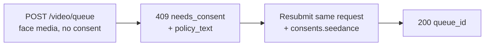

Seedance 2.0 的图生视频和参考生视频模型可以基于您提供的**人脸**驱动视频。当 Venice API 在您提交的媒体中检测到人脸时，会在处理媒体前要求一次性的**同意证明**。这是面向带人脸输入的提供商要求，可防止未经同意的肖像使用。

本指南准确说明您发送什么、收到什么以及如何处理重复请求。

## 何时需要同意

只有当**同时**满足以下两个条件时才会请求同意：

1. 模型是支持人脸的 Seedance 变体：
   - `seedance-2-0-image-to-video`、`seedance-2-0-reference-to-video`
   - `seedance-2-0-fast-image-to-video`、`seedance-2-0-fast-reference-to-video`
2. 提交的媒体在以下任一字段中实际包含可检测的人脸：`image_url`、`end_image_url`、`reference_image_urls`、`reference_video_urls`。

如果这些字段中**没有人脸**，请求将照常进行，无需同意步骤。文生视频永远不会进入此流程。

<Note>
同意并不会解锁受限内容。被检测出**未成年人结合性暗示 prompt/NSFW**，或可识别的**公众人物肖像**，将作为内容政策违规（`422`）被拒绝，**无法**通过同意证明来变得可接受。
</Note>

## 两次调用流程



### 调用 1 —— 不带同意提交

像往常一样提交您的生成请求 —— 不带同意字段：

```bash
curl -X POST https://api.venice.ai/api/v1/video/queue \
  -H "Authorization: Bearer $VENICE_API_KEY" \
  -H "Content-Type: application/json" \
  -d '{
    "model": "seedance-2-0-reference-to-video",
    "prompt": "Refer to <Subject 1> in <Image 1> to generate a 5-second clip of the same person walking through a sunlit market.",
    "reference_image_urls": ["https://example.com/person.jpg"],
    "duration": "5s",
    "aspect_ratio": "9:16",
    "resolution": "1080p"
  }'
```

如果检测到人脸且您尚未证明同意，您将获得一个不计费的 **`409`**：

```json
{
  "error": {
    "code": "needs_consent",
    "message": "Seedance consent is required for this request."
  },
  "consent_flow": "seedance",
  "face_media_roles": ["reference_image"],
  "consent": {
    "consent_version": "v2.0",
    "policy_text": "The likeness in any media you upload is your own, or you have explicit, legal consent from any depicted individual(s). Note: an image may contain more than one face — your attestation covers all of them.\nYou own or have permission to use all media you uploaded for content generation.\nYou agree to the Venice.ai Terms of Service and Privacy Policy. Violations can lead to account suspension and legal liability.\nNo content is stored by Venice."
  },
  "docs_url": "https://docs.venice.ai/guides/media/seedance-face-consent"
}
```

| 字段 | 含义 |
|---|---|
| `face_media_roles` | 您的哪些输入包含人脸：`image`、`end_image`、`reference_image`、`reference_video` |
| `consent.policy_text` | 您必须同意的确切证明文本。请向负责此请求的人展示。 |
| `consent.consent_version` | 当前政策版本（由服务器设置；可能随时间变化）。仅供参考 —— 您**不需要**将其回传。 |

`409` 状态下不会扣除额度或 x402 付款。

### 调用 2 —— 带同意重新提交

重新发送**相同的请求体**，添加包含三个全部为 `true` 的确认的 `consents.seedance` 对象：

```bash
curl -X POST https://api.venice.ai/api/v1/video/queue \
  -H "Authorization: Bearer $VENICE_API_KEY" \
  -H "Content-Type: application/json" \
  -d '{
    "model": "seedance-2-0-reference-to-video",
    "prompt": "Refer to <Subject 1> in <Image 1> to generate a 5-second clip of the same person walking through a sunlit market.",
    "reference_image_urls": ["https://example.com/person.jpg"],
    "duration": "5s",
    "aspect_ratio": "9:16",
    "resolution": "1080p",
    "consents": {
      "seedance": {
        "confirmed_terms_and_privacy": true,
        "confirmed_legal_right": true,
        "confirmed_screening_acknowledged": true
      }
    }
  }'
```

成功提交将返回正常的队列响应：

```json
{ "model": "seedance-2-0-reference-to-video", "queue_id": "..." }
```

然后照常使用 `queue_id` 轮询 `POST /api/v1/video/retrieve`（参见[视频生成](/guides/media/video-generation)）。

## 同意对象

```json
{
  "confirmed_terms_and_privacy": true,
  "confirmed_legal_right": true,
  "confirmed_screening_acknowledged": true
}
```

| 字段 | 您确认… |
|---|---|
| `confirmed_terms_and_privacy` | 您接受 `409` 中返回的 `policy_text`，包括 Venice 服务条款和隐私政策 |
| `confirmed_legal_right` | 该肖像是您自己的，或您已从每一位被描绘的个人处获得明确、合法的同意 |
| `confirmed_screening_acknowledged` | 您承认提交的媒体在处理前可能会被自动筛查 |

<Warning>
所有三个字段必须为布尔值 `true`。任何缺失字段、`false` 或任何**额外**字段 —— 包括 `consent_version` —— 都会被以 `400` 拒绝。政策版本始终由服务器设置；客户端永远不发送或选择版本。
</Warning>

## 重复请求（去重）

如果您提交的是**完全相同的媒体字节**，并且您已经为其做过证明，API 将识别该媒体并**不再**请求同意 —— 在后续相同提交中可省略 `consents.seedance`。此匹配基于确切的图像字节：重新编码、调整尺寸或裁剪都会产生不同的字节，并会再次请求同意。

部分匹配（一个先前已证明的输入加上一个新的人脸输入）仍需要在新提交中提供新的 `consents.seedance`。

## 撤销

要撤销同意并删除已存储的人脸资产，请登录 Venice Web 应用（**Settings**）。撤销不可通过公开 API 进行。撤销后，下一次使用该媒体的请求将再次请求同意。

## 付款

同意决策始终在任何收费**之前**发生，对两种付款方式均适用：

- **API 密钥：** `409`/`422` 在扣除额度之前返回；被阻止的请求不计费。
- **x402：** 消费扣款仅在成功生成后进行，因此 `409`/`422` 不会结算。请使用同意（和新的 x402 授权）重新提交以继续。

## 错误参考

| 状态 | 响应体 `error` | 原因 |
|---|---|---|
| `409` | `needs_consent` | 检测到人脸，没有有效的 `consents.seedance`，没有精确媒体匹配。带上同意重新提交。 |
| `400` | 验证错误 | `consents.seedance` 格式错误 —— 缺失/`false` 确认或额外字段（如 `consent_version`）。 |
| `422` | `CONTENT_POLICY_VIOLATION` | 检测到未成年人结合性暗示/NSFW 内容，或公众人物肖像。同意不会覆盖此情况。 |
| `422` | `IMAGE_ASPECT_RATIO_OUT_OF_BOUNDS` | **检测到人脸的图像**的宽/高比超出允许的 `(0.4, 2.5)` 范围。在人脸资产配置期间同步检查（扣款前）；仅在该图像中检测到人脸时适用。 |

## 参考

- 视频队列端点：[`POST /api/v1/video/queue`](/api-reference/endpoint/video/queue)
- [Seedance 2.0 指南](/guides/media/seedance-2-0) —— 变体、工作流、prompt 语法、限制
- [视频生成](/guides/media/video-generation) —— 队列/轮询概述
