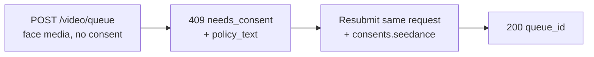

Seedance 2.0 的 image-to-video 与 reference-to-video 模型可以根据您提供的**人脸**来驱动视频。当 Venice API 在您提交的媒体中检测到人脸时，会要求在处理该媒体前进行一次性的**同意声明**。这是针对含人脸输入的提供方要求，用于防范未经同意的相似度使用。

本指南准确说明您需要发送什么、会收到什么，以及重复请求如何处理。

## 何时需要同意声明

只有在**同时满足**以下两点时才会请求同意：

1. 使用的是符合条件的 Seedance 人脸模型变体：
   - `seedance-2-0-image-to-video`、`seedance-2-0-reference-to-video`
   - `seedance-2-0-fast-image-to-video`、`seedance-2-0-fast-reference-to-video`
2. 提交的媒体在以下任一字段中实际包含可检测到的人脸：`image_url`、`end_image_url`、`reference_image_urls`、`reference_video_urls`。

如果这些字段中**没有人脸**，请求会正常继续，不涉及同意声明步骤。Text-to-video 永远不会进入此流程。

<Note>
同意声明并不会解锁受限内容。若检测到**未成年人与暗示性 / NSFW 提示词的组合**，或**可识别的公众人物相似度**，将作为内容策略违规被拒绝（`422`），**无法**通过声明同意来使其被接受。
</Note>

## 两步调用流程


```mermaid
flowchart LR
  A[POST /video/queue<br/>face media, no consent] --> B[409 needs_consent<br/>+ policy_text]
  B --> C[Resubmit same request<br/>+ consents.seedance]
  C --> D[200 queue_id]
```

### 第 1 步：不带同意声明提交

像平常一样提交生成请求，不带 consent 字段：

```bash
curl -X POST https://api.venice.ai/api/v1/video/queue \
  -H "Authorization: Bearer $VENICE_API_KEY" \
  -H "Content-Type: application/json" \
  -d '{
    "model": "seedance-2-0-reference-to-video",
    "prompt": "Refer to <Subject 1> in <Image 1> to generate a 5-second clip of the same person walking through a sunlit market.",
    "reference_image_urls": ["https://example.com/person.jpg"],
    "duration": "5s",
    "aspect_ratio": "9:16",
    "resolution": "1080p"
  }'
```

如果检测到人脸而您尚未声明同意，会收到一个不扣费的 **`409`**：

```json
{
  "error": {
    "code": "needs_consent",
    "message": "Seedance consent is required for this request."
  },
  "consent_flow": "seedance",
  "face_media_roles": ["reference_image"],
  "consent": {
    "consent_version": "v2.0",
    "policy_text": "The likeness in any media you upload is your own, or you have explicit, legal consent from any depicted individual(s). Note: an image may contain more than one face — your attestation covers all of them.\nYou own or have permission to use all media you uploaded for content generation.\nYou agree to the Venice.ai Terms of Service and Privacy Policy. Violations can lead to account suspension and legal liability.\nNo content is stored by Venice."
  },
  "docs_url": "https://docs.venice.ai/guides/media/seedance-face-consent"
}
```

| 字段 | 含义 |
|---|---|
| `face_media_roles` | 您输入中包含人脸的部分：`image`、`end_image`、`reference_image`、`reference_video` |
| `consent.policy_text` | 您必须同意的确切声明文本。请将其呈现给对本次请求负责的人。 |
| `consent.consent_version` | 当前政策版本（由服务器设定，可能随时间变化）。仅供参考，您**不需要**在回传中提交它。 |

`409` 时不会扣除任何额度或 x402 付款。

### 第 2 步：带同意声明重新提交

重新发送**相同的请求体**，并添加一个 `consents.seedance` 对象，其中包含三项确认，均为 `true`：

```bash
curl -X POST https://api.venice.ai/api/v1/video/queue \
  -H "Authorization: Bearer $VENICE_API_KEY" \
  -H "Content-Type: application/json" \
  -d '{
    "model": "seedance-2-0-reference-to-video",
    "prompt": "Refer to <Subject 1> in <Image 1> to generate a 5-second clip of the same person walking through a sunlit market.",
    "reference_image_urls": ["https://example.com/person.jpg"],
    "duration": "5s",
    "aspect_ratio": "9:16",
    "resolution": "1080p",
    "consents": {
      "seedance": {
        "confirmed_terms_and_privacy": true,
        "confirmed_legal_right": true,
        "confirmed_screening_acknowledged": true
      }
    }
  }'
```

提交成功后返回正常的队列响应：

```json
{ "model": "seedance-2-0-reference-to-video", "queue_id": "..." }
```

然后像往常一样使用该 `queue_id` 轮询 `POST /api/v1/video/retrieve`（参见 [Video Generation](/guides/media/video-generation)）。

## consent 对象

```json
{
  "confirmed_terms_and_privacy": true,
  "confirmed_legal_right": true,
  "confirmed_screening_acknowledged": true
}
```

| 字段 | 您确认…… |
|---|---|
| `confirmed_terms_and_privacy` | 您接受 `409` 中返回的 `policy_text`，包括 Venice 的服务条款与隐私政策 |
| `confirmed_legal_right` | 该相似度属于您本人，或您已获得所有出现个人的明确、合法同意 |
| `confirmed_screening_acknowledged` | 您了解所提交的媒体在处理前可能会被自动筛查 |

<Warning>
三个字段必须都为布尔值 `true`。任何缺失字段、`false` 或任何**额外**字段（包括 `consent_version`）都会被以 `400` 拒绝。政策版本始终由服务器设定，客户端从不发送或选择版本。
</Warning>

## 重复请求（去重）

如果您提交的是**完全相同的媒体字节**，并且您此前已对其声明过同意，API 会识别到并**无需**再次请求同意，您可以在后续相同的提交中省略 `consents.seedance`。此匹配基于图像的精确字节：重新编码、缩放或裁剪会产生不同的字节，仍然会再次请求同意。

部分匹配（一个先前已声明的输入加上一个新的人脸输入）在新提交中仍然需要新的 `consents.seedance`。

## 撤销

若要撤销同意并删除已存储的人脸资产，请登录 Venice 网页应用（**Settings**）。公共 API 不提供撤销功能。撤销后，下一次使用该媒体的请求会重新请求同意。

## 付款

同意决定始终发生在**任何扣费之前**，对两种付款方式均如此：

- **API key：** `409`/`422` 在扣除额度之前返回，被阻止的请求不会计费。
- **x402：** 消费扣费仅在成功生成后运行，因此 `409`/`422` 不会结算任何费用。请重新提交并附带同意声明（以及一次新的 x402 授权）以继续。

## 错误参考

| 状态 | Body `error` | 原因 |
|---|---|---|
| `409` | `needs_consent` | 检测到人脸，且没有有效的 `consents.seedance`，也没有精确媒体匹配。请带上同意声明重新提交。 |
| `400` | 校验错误 | `consents.seedance` 格式错误：缺少 / `false` 的确认字段，或存在类似 `consent_version` 的额外字段。 |
| `422` | `CONTENT_POLICY_VIOLATION` | 检测到未成年人加暗示性 / NSFW 内容，或公众人物相似度。同意声明不会覆盖此判定。 |
| `422` | `IMAGE_ASPECT_RATIO_OUT_OF_BOUNDS` | **检测到人脸的图像**超出允许的 `(0.4, 2.5)` 宽高比区间。此检查在人脸资产配置期间同步进行（先于扣费），仅在该图像中检测到人脸后适用。 |

## 参考资料

- 视频队列端点：[`POST /api/v1/video/queue`](/api-reference/endpoint/video/queue)
- [Seedance 2.0 指南](/guides/media/seedance-2-0)：变体、工作流、提示词语法、限制
- [Video Generation](/guides/media/video-generation)：队列 / 轮询概览
